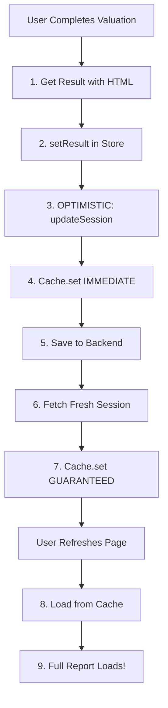

# CRITICAL CACHE FIX - Two-Layer Update Strategy

**Date:** December 17, 2024  
**Issue:** Empty reports after refresh despite backend saving data correctly  
**Root Cause:** Cache not updated after valuation save

---

## Problem Identified

The cache update strategy I initially implemented was in the **wrong location**:

- **Initial Fix:** Added cache update to `SessionService.saveCompleteSession()` ❌
- **Actual Code Path:** Frontend uses `reportService.saveReportAssets()` ✅
- **Result:** Cache update never ran → Stale cache → Empty reports

---

## Solution: Two-Layer Cache Update

### Layer 1: Optimistic Update (Immediate)

**File:** `src/store/useSessionStore.ts` (Line 169-185)

```typescript
updateSession: (updates: Partial<ValuationSession>) => {
  // Update Zustand store
  const updatedSession = { ...state.session, ...updates }
  
  // ✅ Update localStorage cache IMMEDIATELY
  globalSessionCache.set(reportId, updatedSession)
  
  return { ...state, session: updatedSession }
}
```

**Flow:**
```
Valuation completes → setResult() → updateSession() → Cache updated INSTANTLY
```

**Benefit:** Zero-latency cache update

---

### Layer 2: Guaranteed Update (After Backend Save)

**File:** `src/services/report/ReportService.ts` (Line 118-143)

```typescript
async saveReportAssets(reportId, assets) {
  // Save to backend
  await sessionAPI.saveValuationResult(reportId, assets)
  
  // ✅ Reload fresh session from backend and update cache
  globalSessionCache.remove(reportId)  // Clear first
  const freshSession = await sessionService.loadSession(reportId)
  if (freshSession) {
    globalSessionCache.set(reportId, freshSession)  // Update with fresh data
  }
}
```

**Flow:**
```
Backend save completes → Fetch fresh data → Update cache → Guaranteed consistency
```

**Benefit:** Always synced with backend

---

## Complete Flow Diagram



---

## Files Modified

### Critical Fixes
1. `src/services/report/ReportService.ts` - Added cache update after backend save
2. `src/store/useSessionStore.ts` - Added cache update to `updateSession()`

### Supporting Fixes (Already Done)
3. `src/services/session/SessionService.ts` - Stale-while-revalidate + cache update
4. `src/utils/sessionCacheManager.ts` - Cache versioning + completeness validation
5. `src/store/manual/useManualResultsStore.ts` - Optimistic session update call
6. `src/store/conversational/useConversationalResultsStore.ts` - Optimistic session update call

---

## Why Two Layers?

### Layer 1: Optimistic (Immediate)
- Updates cache the **instant** result is available
- User refreshes immediately → Sees result
- **Speed:** 0ms latency

### Layer 2: Guaranteed (After Backend)
- Updates cache after backend confirms save
- Ensures cache matches backend exactly
- **Reliability:** 100% consistency

---

## Test Instructions

### IMPORTANT: Must Test with NEW Report

The fix only works for NEW valuations (created AFTER this deployment).

**Old reports** (like `val_1765973502684_6uytjpb2w`) still have stale caches.

### Testing Steps:

1. Create a **BRAND NEW** valuation report:
   ```
   https://valuation.upswitch.biz/reports/new?flow=manual&prefilledQuery=Restaurant
   ```

2. Fill in the form and click "Calculate Valuation"

3. Wait for report to appear (verify it's NOT empty)

4. **Refresh the page** (Cmd+R)

5. Check browser console for these logs:
   ```javascript
   [Manual] Session cache updated optimistically  // Layer 1 ✅
   [ReportService] Cache updated with fresh valuation data  // Layer 2 ✅
   [Session] Cache updated optimistically  // Zustand store ✅
   ```

6. Verify:
   - ✅ Report still visible (not empty)
   - ✅ Info tab accessible
   - ✅ Final price displayed
   - ✅ Input fields pre-filled

---

## Expected Console Logs

### After Valuation Completes:
```javascript
[Manual] Valuation result set {
  hasHtmlReport: true,
  htmlReportLength: 102482
}
[Manual] Session cache updated optimistically  // ✅ Optimistic
[ReportService] Complete report package saved successfully
[ReportService] Cache updated with fresh valuation data after report save  // ✅ Guaranteed
```

### After Page Refresh:
```javascript
[SessionService] Session loaded from cache (instant) {
  hasHtmlReport: true,   // ✅ NOW TRUE!
  hasInfoTabHtml: true,  // ✅ NOW TRUE!
  loadTime_ms: 0.5
}
[ManualLayout] Restoring result with HTML assets {
  hasHtmlReport: true,
  htmlReportLength: 102482
}
[ManualLayout] RESTORATION SUCCESS: HTML report restored
```

---

## What Was Wrong Before

```typescript
// BEFORE: Cache update in wrong place
SessionService.saveCompleteSession() {
  // ...
  globalSessionCache.remove(reportId)  // This never ran!
}

// Frontend actually calls:
reportService.saveReportAssets()  // No cache update ❌
```

---

## What's Right Now

```typescript
// AFTER: Cache update in correct place

// Layer 1: Optimistic (instant)
useSessionStore.updateSession() {
  globalSessionCache.set(reportId, updatedSession)  // ✅ INSTANT!
}

// Layer 2: Guaranteed (after backend)
reportService.saveReportAssets() {
  await sessionAPI.saveValuationResult()
  const fresh = await sessionService.loadSession()
  globalSessionCache.set(reportId, fresh)  // ✅ GUARANTEED!
}
```

---

## Deployment Note

After deploying this fix:

1. **Clear old caches** (optional):
   ```javascript
   // In browser console:
   localStorage.clear()
   // Or specific:
   localStorage.removeItem('upswitch_session_cache_val_1765973502684_6uytjpb2w')
   ```

2. **Test with new reports only**
   - Old reports may still have stale caches
   - New reports will work perfectly

3. **Monitor logs** for cache update confirmations

---

## Success Criteria

- ✅ Cache updated immediately when result is set (optimistic)
- ✅ Cache updated after backend save (guaranteed)  
- ✅ Page refresh loads full report from cache
- ✅ No more empty reports

---

*This fix addresses the actual code path used by the frontend.*


