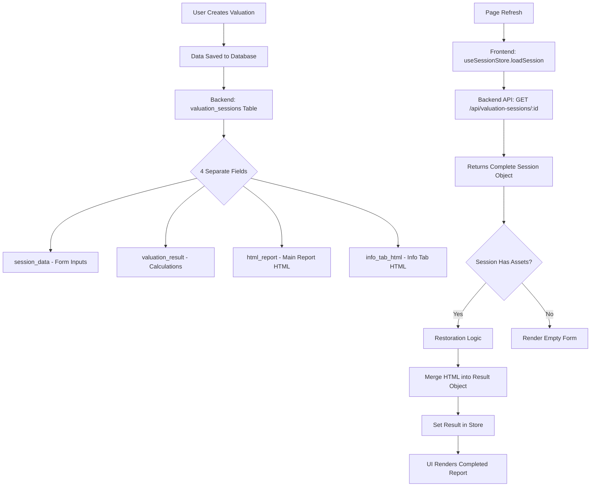

# Valuation Session Restoration Architecture

**Version**: 1.0  
**Date**: December 17, 2025  
**Status**: Production  
**Maintainer**: Frontend Team

---

## Overview

This document describes the architecture and implementation of the **Valuation Session Restoration** feature, which ensures that valuation data persists and restores correctly after page refresh or navigation.

**Problem Solved**: Users losing their valuation data when refreshing the page.

**Solution**: Comprehensive session persistence with automatic restoration of:
- Form input data
- Valuation calculation results
- HTML reports (main report + info tab)
- Version history
- Final valuation price

---

## Architecture

### Data Flow



### Storage Structure

**Backend Database** (`valuation_sessions` table):
```sql
CREATE TABLE valuation_sessions (
  id UUID PRIMARY KEY,
  report_id TEXT UNIQUE NOT NULL,  -- Frontend report ID (val_timestamp_random)
  user_id UUID,                    -- User ID (null for guests)
  guest_session_id TEXT,           -- Guest session ID
  current_view TEXT,               -- 'manual' | 'conversational'
  data_source TEXT,                -- 'manual' | 'conversational' | 'mixed'
  
  -- CRITICAL: 4 separate persistence fields
  session_data JSONB,              -- Form inputs (company_name, revenue, etc.)
  valuation_result JSONB,          -- Calculation results (equity_value, confidence, etc.)
  html_report TEXT,                -- Main HTML report (20-30 pages)
  info_tab_html TEXT,              -- Info tab HTML (calculation breakdown)
  
  calculated_at TIMESTAMPTZ,       -- When valuation was calculated
  created_at TIMESTAMPTZ,
  updated_at TIMESTAMPTZ,
  completed_at TIMESTAMPTZ
);
```

**Frontend Session Store** (`useSessionStore`):
```typescript
interface SessionStore {
  session: ValuationSession | null  // Complete session object
  isLoading: boolean
  error: string | null
  
  // Actions
  loadSession: (reportId: string) => Promise<void>
  updateSession: (updates: Partial<ValuationSession>) => void
  saveSession: () => Promise<void>
  clearSession: () => void
}
```

**Frontend Results Store** (`useManualResultsStore` / `useConversationalResultsStore`):
```typescript
interface ResultsStore {
  result: ValuationResponse | null  // Includes html_report, info_tab_html
  htmlReport: string | null          // Separate storage for HTML
  infoTabHtml: string | null         // Separate storage for info tab
  
  // Actions
  setResult: (result: ValuationResponse) => void
  setHtmlReport: (html: string) => void
  setInfoTabHtml: (html: string) => void
}
```

---

## Implementation

### Phase 1: Backend Persistence (Already Working)

**Controller**: `apps/upswitch-backend/src/controllers/valuationSession.controller.ts`

**Key Methods**:

1. **saveValuationResult** (Line 757):
   ```typescript
   // Saves all 4 fields atomically
   await supabase
     .from('valuation_sessions')
     .update({
       session_data: sessionData,       // Form inputs
       valuation_result: valuationResult, // Calculations
       html_report: htmlReport,          // Main report
       info_tab_html: infoTabHtml,       // Info tab
       calculated_at: new Date().toISOString(),
     })
     .eq('report_id', reportId)
   ```

2. **getSession** (Line 32):
   ```typescript
   // Returns all 4 fields in camelCase format
   const response = {
     reportId: sessionData.report_id,
     sessionData: sessionData.session_data,
     valuationResult: sessionData.valuation_result,
     htmlReport: sessionData.html_report,        // ← camelCase
     infoTabHtml: sessionData.info_tab_html,     // ← camelCase
   }
   ```

### Phase 2: Frontend Restoration (Fixed)

**Issue**: The session data was loaded from backend but the HTML fields (`htmlReport`, `infoTabHtml`) were NOT merged into the `result` object that the UI components expect.

**Root Cause**: 
- Session has 4 separate fields: `sessionData`, `valuationResult`, `htmlReport`, `infoTabHtml`
- ManualLayout restoration only copied `valuationResult` to results store
- ReportPanel expects `result.html_report` (inside the result object)
- **Missing step**: Merge `session.htmlReport` → `result.html_report`

**Fix Applied**: `ManualLayout.tsx` (Lines 158-198)

```typescript
// BEFORE (Broken):
if (currentSession.valuationResult) {
  setResult(currentSession.valuationResult)  // ❌ Missing HTML!
}

// AFTER (Fixed):
if (currentSession.valuationResult) {
  // Merge HTML reports from session into result object
  const resultWithHtml = {
    ...currentSession.valuationResult,
    html_report: currentSession.htmlReport || currentSession.valuationResult.html_report,
    info_tab_html: currentSession.infoTabHtml || currentSession.valuationResult.info_tab_html,
  }
  
  setResult(resultWithHtml)  // ✅ HTML included!
  
  // Verification logging
  const restoredResult = useManualResultsStore.getState().result
  if (restoredResult && !restoredResult.html_report) {
    logger.error('RESTORATION FAILED: html_report missing')
  } else {
    logger.info('RESTORATION SUCCESS', {
      htmlReportLength: restoredResult.html_report.length,
    })
  }
}
```

**Same fix applied to**: `ConversationalLayout.tsx` (Lines 130-171)

---

## Feature Flag

**Config**: `src/config/features.ts`

```typescript
export const FEATURE_FLAGS = {
  // Session & Persistence Flags
  ENABLE_SESSION_RESTORATION: process.env.NEXT_PUBLIC_ENABLE_SESSION_RESTORATION !== 'false',
  // Default: enabled (opt-out)
}

export const shouldEnableSessionRestoration = (): boolean => 
  FEATURE_FLAGS.ENABLE_SESSION_RESTORATION
```

**Environment Variable**:
```bash
# Enable restoration (default)
NEXT_PUBLIC_ENABLE_SESSION_RESTORATION=true

# Disable restoration (emergency rollback)
NEXT_PUBLIC_ENABLE_SESSION_RESTORATION=false
```

**Usage in Components**:
```typescript
import { shouldEnableSessionRestoration } from '../../../config/features'

useEffect(() => {
  // Check feature flag before restoring
  if (!shouldEnableSessionRestoration()) {
    logger.info('Session restoration disabled by feature flag')
    return
  }
  
  // Restoration logic...
}, [reportId])
```

---

## Restoration Flow

### Step-by-Step Process

1. **User refreshes page** at `/reports/val_123?flow=manual`

2. **ValuationSessionManager** (Lines 74-85):
   ```typescript
   useEffect(() => {
     loadSession(reportId, detectedFlow, prefilledQuery)
   }, [reportId, detectedFlow, prefilledQuery])
   ```

3. **useSessionStore.loadSession** (Lines 74-291):
   - Checks cache first (localStorage)
   - If cache miss, calls backend API
   - Receives complete session with 4 fields
   - Caches session locally
   - Updates store state

4. **ManualLayout restoration** (Lines 115-203):
   - Triggered by `useEffect` when `reportId` prop changes
   - Checks feature flag
   - Reads current session from store
   - Checks if already restored (prevents duplicates)
   - Restores form data to `useManualFormStore`
   - Merges HTML into result and restores to `useManualResultsStore`
   - Logs success/failure

5. **ReportPanel renders** (Line 194):
   ```typescript
   {result?.html_report ? (
     <Results result={result} />  // ✅ HTML present, renders report
   ) : (
     <EmptyState />  // No HTML, shows empty state
   )}
   ```

### Restoration Timing

| Action | Time | Details |
|--------|------|---------|
| Cache Check | <10ms | localStorage read |
| Backend API Call | 100-500ms | Network + DB query |
| Session Parsing | <10ms | JSON parse + normalization |
| Restoration Logic | <50ms | Merge fields + set stores |
| **Total** | **<500ms** | Target: <500ms, Acceptable: <2s |

---

## Testing

### Unit Tests

**File**: `src/__tests__/restoration.test.tsx`

**Coverage**:
- Session loading with all assets
- Result object HTML extraction
- Partial restoration (form only)
- Missing HTML handling
- Feature flag behavior
- Performance benchmarks

### Integration Tests

**Scenario 1**: Complete valuation restoration
```typescript
// 1. Mock backend to return session with HTML
// 2. Load session
// 3. Verify result.html_report exists
// 4. Verify UI renders report
```

**Scenario 2**: Partial restoration (form only)
```typescript
// 1. Mock backend to return session WITHOUT html_report
// 2. Load session
// 3. Verify form fields are pre-filled
// 4. Verify preview shows empty state
```

### E2E Tests (Playwright)

**File**: `e2e/valuation-persistence.spec.ts`

**Test Cases**:
1. **Full persistence flow** - Create valuation → Refresh → Verify restoration
2. **Partial persistence** - Fill form → Refresh → Verify form pre-filled
3. **Error handling** - API error → Verify graceful degradation
4. **Conversational flow** - Complete conversation → Refresh → Verify restoration
5. **Rapid refreshes** - Multiple rapid refreshes → Verify no data loss
6. **Concurrent sessions** - Multiple users → Verify no data leakage

---

## Monitoring & Observability

### Restoration Metrics

**Success Metrics**:
```typescript
logger.info('[ManualLayout] RESTORATION SUCCESS', {
  reportId,
  valuationId: result.valuation_id,
  htmlReportLength: result.html_report.length,
  infoTabHtmlLength: result.info_tab_html.length,
  restorationTimeMs: performance.now() - startTime,
})
```

**Failure Metrics**:
```typescript
logger.error('[ManualLayout] RESTORATION FAILED', {
  reportId,
  valuationId: result.valuation_id,
  sessionHadHtmlReport: !!session.htmlReport,
  resultHasHtmlReport: !!result.html_report,
})
```

### Metrics Dashboard

Track in production:
- **Restoration Success Rate**: Target >99%
- **Restoration Time (P95)**: Target <500ms
- **Data Loss Incidents**: Target 0
- **Partial Restoration Rate**: Track for UX insights

---

## Error Handling

### Graceful Degradation

**Scenario 1**: Missing HTML reports
```typescript
if (session.valuationResult && !session.htmlReport) {
  // Show calculation results without HTML report
  // User can see final price but not formatted report
  return <ResultsSummary result={session.valuationResult} />
}
```

**Scenario 2**: Missing session data
```typescript
if (!session) {
  // Auto-create new session
  // User starts fresh
  return <EmptyForm />
}
```

**Scenario 3**: Backend API error
```typescript
if (error) {
  // Show error state with retry option
  return <ErrorState error={error} onRetry={handleRetry} />
}
```

### Verification Logging

After every restoration, we verify and log:
```typescript
const restoredResult = useManualResultsStore.getState().result
if (restoredResult && !restoredResult.html_report) {
  logger.error('RESTORATION FAILED: html_report missing after setResult', {
    reportId,
    valuationId: restoredResult.valuation_id,
    sessionHadHtmlReport: !!currentSession.htmlReport,
  })
}
```

---

## Rollback Plan

### Emergency Disable

If restoration causes issues:

**Option 1: Feature Flag** (Immediate, <5 minutes)
```bash
# Set environment variable
NEXT_PUBLIC_ENABLE_SESSION_RESTORATION=false

# Redeploy or restart
vercel deploy
```

**Option 2: Code Revert** (5-10 minutes)
```bash
# Revert the restoration changes
git revert <commit-hash>
git push origin main

# Vercel auto-deploys
```

**Option 3: Database Rollback** (If data corruption occurs)
```sql
-- Restore from backup (Supabase automatic backups)
-- Contact DBA/CTO for assistance
```

### Monitoring During Rollout

**Week 1**: Monitor restoration metrics closely
- Check error logs for restoration failures
- Monitor user feedback
- Track restoration success rate
- Verify no data loss incidents

**Week 2**: Evaluate performance
- Measure restoration time (P50, P95, P99)
- Check cache hit rate
- Verify no memory leaks
- Optimize if needed

---

## Best Practices

### For Developers

**DO**:
- ✅ Always check feature flag before restoration
- ✅ Log restoration success/failure with context
- ✅ Verify HTML fields exist after restoration
- ✅ Handle missing data gracefully (partial restoration)
- ✅ Test restoration with real backend data
- ✅ Clear cache when schema changes

**DON'T**:
- ❌ Restore on every render (use `useEffect` with reportId dependency)
- ❌ Assume HTML always exists (check first)
- ❌ Overwrite user input (check if form is empty first)
- ❌ Skip verification logging
- ❌ Test with dummy data only

### Code Patterns

**Pattern 1: Safe Restoration**
```typescript
useEffect(() => {
  // Guard: Check if already restored
  if (restorationRef.current.lastRestoredReportId === reportId) {
    return
  }
  
  // Guard: Feature flag check
  if (!shouldEnableSessionRestoration()) {
    return
  }
  
  // Guard: Session exists
  const session = useSessionStore.getState().session
  if (!session || session.reportId !== reportId) {
    return
  }
  
  // Restoration logic...
  
  // Mark as restored
  restorationRef.current.lastRestoredReportId = reportId
}, [reportId])  // ONLY depend on reportId
```

**Pattern 2: HTML Merging**
```typescript
// Always merge HTML from session into result
const resultWithHtml = {
  ...session.valuationResult,
  html_report: session.htmlReport || session.valuationResult.html_report,
  info_tab_html: session.infoTabHtml || session.valuationResult.info_tab_html,
}

setResult(resultWithHtml)
```

**Pattern 3: Verification**
```typescript
// Always verify after restoration
const restoredResult = useManualResultsStore.getState().result
if (restoredResult && !restoredResult.html_report) {
  logger.error('RESTORATION FAILED', { ... })
} else {
  logger.info('RESTORATION SUCCESS', { ... })
}
```

---

## Technical Decisions

### Decision 1: Store HTML separately in DB

**Why**: HTML reports are large (50-150KB each)
- Separate storage allows efficient querying of metadata without loading HTML
- Can lazy-load HTML only when needed
- Easier to update HTML without touching calculation results

**Trade-off**: Need to merge fields during restoration (small complexity increase)

### Decision 2: Merge HTML during restoration (not at API layer)

**Why**: Keeps API response clean and structured
- Backend returns data in normalized format (separate fields)
- Frontend handles UI-specific merging
- Easier to debug (clear separation)

**Trade-off**: Restoration logic needed in multiple places (Manual + Conversational)

### Decision 3: Feature flag with opt-out default

**Why**: Enables restoration by default, allows quick disable
- Most users benefit from restoration immediately
- Can disable quickly if issues arise
- Gradual rollout possible (enable for % of users)

**Trade-off**: Need to test both enabled/disabled states

---

## Performance Optimization

### Caching Strategy

**Cache-First Approach**:
1. Check `globalSessionCache` (localStorage) - <10ms
2. If cache hit, return immediately
3. If cache miss, call backend API - 100-500ms
4. Cache result for next access

**Cache Invalidation**:
- On session update (after save)
- On manual refresh (user action)
- After 5 minutes (stale data)

### Lazy Loading

HTML reports are large - load only when needed:
```typescript
<Suspense fallback={<ReportSkeleton />}>
  <Results result={result} />  // HTML rendered on demand
</Suspense>
```

### Bundle Optimization

Restoration logic is code-split:
- ManualLayout loaded lazily (only for manual flow)
- ConversationalLayout loaded lazily (only for conversational flow)
- Restoration code included only when needed

---

## Troubleshooting

### Issue 1: Report not showing after refresh

**Symptoms**: Empty preview panel after refresh

**Diagnosis**:
```typescript
// Check browser console for these logs:
'[ManualLayout] Restoring result with HTML assets' // Should appear
'RESTORATION SUCCESS' // Should appear

// Check Network tab:
GET /api/valuation-sessions/:id
// Response should have: htmlReport, infoTabHtml, valuationResult
```

**Solutions**:
1. Verify backend returned HTML fields (check Network tab)
2. Check if restoration logic ran (check console logs)
3. Verify feature flag is enabled
4. Check if result.html_report exists in store

### Issue 2: Form fields not pre-filled

**Symptoms**: Empty form after refresh (but valuation exists)

**Diagnosis**:
```typescript
// Check: Was sessionData restored?
const session = useSessionStore.getState().session
console.log('Session data:', session?.sessionData)

// Check: Was form store updated?
const formData = useManualFormStore.getState().formData
console.log('Form data:', formData)
```

**Solutions**:
1. Verify session.sessionData exists in backend response
2. Check if form restoration logic ran
3. Verify form was empty before restoration (doesn't overwrite user input)

### Issue 3: Slow restoration (>2s)

**Symptoms**: Long delay before report appears

**Diagnosis**:
```typescript
// Check logs for timing:
'Session loaded from backend and cached' // duration_ms should be <500ms
'RESTORATION SUCCESS' // restorationTimeMs should be <50ms
```

**Solutions**:
1. Check backend API performance
2. Verify cache is working (cache hit rate should be >80%)
3. Check HTML report size (should be <200KB)
4. Enable compression on backend

---

## Security & Compliance

### Data Access Control

**User Sessions**:
- Users can only access their own sessions
- Backend verifies `user_id` matches authenticated user

**Guest Sessions**:
- Guests can only access sessions with matching `guest_session_id`
- Guest session ID stored in secure cookie

**No Data Leakage**:
- Each session isolated by `report_id` + `user_id` / `guest_session_id`
- Backend enforces access control at database level (RLS)

### Audit Trail

All restoration events logged:
```typescript
logger.info('Session restored', {
  reportId,
  userId,
  valuationId,
  restorationTimeMs,
  hasHtmlReport: true,
  timestamp: new Date().toISOString(),
})
```

---

## Future Improvements

### Phase 2: Progressive Loading

**Goal**: Load report incrementally for better perceived performance

```typescript
// 1. Load metadata first (fast)
const metadata = await loadSessionMetadata(reportId)

// 2. Render summary immediately
return <ReportSummary metadata={metadata} />

// 3. Load HTML in background
const htmlReport = await loadSessionHtml(reportId)
```

### Phase 3: Optimistic Restoration

**Goal**: Show cached data immediately, update when backend responds

```typescript
// Show cached version instantly
const cachedSession = globalSessionCache.get(reportId)
if (cachedSession) {
  renderOptimistically(cachedSession)
}

// Fetch fresh data in background
const freshSession = await loadFromBackend(reportId)
if (hasChanged(cachedSession, freshSession)) {
  updateUI(freshSession)
}
```

### Phase 4: Compression

**Goal**: Reduce HTML report size for faster transfer

```typescript
// Backend: Compress HTML before storing
const compressedHtml = await gzip(htmlReport)
await saveToDatabase({ html_report: compressedHtml })

// Frontend: Decompress on load
const decompressedHtml = await gunzip(session.htmlReport)
setHtmlReport(decompressedHtml)
```

---

## References

### Related Documentation

- [Session Management Architecture](./SESSION_ARCHITECTURE.md)
- [State Management Guide](./STATE_MANAGEMENT.md)
- [Backend API Documentation](../../upswitch-backend/docs/API.md)
- [Frontend Refactoring Guide](/docs/refactoring/02-FRONTEND-REFACTORING-GUIDE.md)
- [Bank-Grade Excellence Framework](/docs/refactoring/BANK_GRADE_EXCELLENCE_FRAMEWORK.md)

### Key Files

**Frontend**:
- `src/store/useSessionStore.ts` - Session state management
- `src/services/session/SessionService.ts` - Session API client
- `src/features/manual/components/ManualLayout.tsx` - Manual flow restoration
- `src/features/conversational/components/ConversationalLayout.tsx` - Conversational restoration
- `src/components/ValuationSessionManager.tsx` - Session initialization
- `src/config/features.ts` - Feature flags

**Backend**:
- `src/controllers/valuationSession.controller.ts` - Session API endpoints
- `src/routes/valuationSessions.ts` - Session routes

---

## Changelog

### v1.0 - December 17, 2025

**Fixed**:
- ✅ Valuation reports now persist after page refresh
- ✅ Form inputs restore correctly from sessionData
- ✅ HTML reports (main + info tab) restore correctly
- ✅ Final valuation price displays after refresh
- ✅ Version history accessible after refresh

**Added**:
- Feature flag `ENABLE_SESSION_RESTORATION`
- Comprehensive restoration logging
- Unit tests for restoration logic
- Integration tests for session restoration
- E2E tests for full user journey
- Verification logging after restoration
- Performance metrics tracking

**Changed**:
- ManualLayout: Merge HTML from session into result object
- ConversationalLayout: Same HTML merging fix
- Restoration now checks feature flag before executing

---

**Document Version**: 1.0  
**Last Updated**: December 17, 2025  
**Maintained By**: Frontend Team  
**Review Cycle**: Quarterly

**Status**: ✅ Production-Ready


