# Session Restoration Robustness Audit

**Date**: December 13, 2025  
**Auditor**: CTO + Senior Developer  
**Scope**: Complete session loading flow from Homepage → Report  
**Severity**: 🔴 CRITICAL - Data loss risk

---

## Executive Summary

**CRITICAL ISSUE IDENTIFIED**: Current `loadSession()` implementation lacks fail-proof mechanisms, creating scenarios where users lose access to existing reports.

**Risk**: User clicks existing report → transient network error → report fails to load → user sees empty form and loses previous data

**Impact**: High - directly violates M&A workflow requirement of "never lose work"

---

## Current Architecture Analysis

### Flow 1: Homepage → Existing Report

```mermaid
sequenceDiagram
    participant User
    participant HomePage
    participant ReportCard
    participant SessionManager
    participant SessionStore
    participant BackendAPI

    User->>HomePage: Clicks report card
    HomePage->>SessionManager: Navigate to /reports/val_123
    SessionManager->>SessionStore: loadSession(val_123)
    SessionStore->>BackendAPI: GET /api/sessions/val_123
    
    alt Network error / Timeout
        BackendAPI--xSessionStore: ❌ Error
        SessionStore--xSessionManager: ❌ Throws error
        SessionManager->>SessionStore: Initialize new session
        SessionStore->>BackendAPI: POST /api/sessions/val_123
        BackendAPI-->>SessionStore: ❌ 409 Conflict (exists)
        SessionManager->>SessionStore: handle409Conflict()
        
        alt handle409Conflict fails
            SessionStore--xSessionManager: ❌ Can't load
            SessionManager->>SessionStore: createFallbackSession()
            SessionStore-->>User: ⚠️ Empty form (DATA LOST)
        end
    end
```



**PROBLEM**: `loadSession()` has NO retry logic. A single network glitch = data loss.

---

## Robustness Gaps Identified

### Gap 1: `loadSession()` Lacks Fail-Proof Patterns ⛔ CRITICAL

**Current Implementation** (lines 140-170 in `useValuationSessionStore.ts`):

```typescript
loadSession: async (reportId: string) => {
  try {
    set({ isSyncing: true, syncError: null });
    const sessionResponse = await backendAPI.getValuationSession(reportId);  // ← NO RETRY
    
    if (sessionResponse?.session) {
      set({
        session: normalizeSessionDates(sessionResponse.session),
        isSyncing: false,
        syncError: null,
      });
    } else {
      set({ isSyncing: false, syncError: 'Session not found' });
      throw new Error('Session not found');
    }
  } catch (error: any) {
    storeLogger.error('Failed to load session', {
      error: extractErrorMessage(error),
      reportId,
    });
    set({
      isSyncing: false,
      syncError: extractErrorMessage(error),
    });
    throw error;  // ← Immediate failure, no retry
  }
},
```

**Missing**:
- ❌ Request deduplication
- ❌ Exponential backoff retry
- ❌ Circuit breaker protection
- ❌ Performance monitoring
- ❌ Audit trail logging
- ❌ Correlation ID tracing

**Comparison**: `createOrLoadSession()` HAS all these features (lines 172-327 in `sessionErrorHandlers.ts`)

**Impact**: 
- Transient network error = immediate failure
- Rate limit = immediate failure
- Backend hiccup = immediate failure
- Result: User sees empty form, loses all data

### Gap 2: Double-Failure Cascade ⛔ CRITICAL

**Scenario**:
1. User clicks report card
2. `loadSession(val_123)` → Network error → Fails
3. Falls through to `initializeSession(val_123)` → Creates new
4. Backend returns 409 (session exists)
5. `handle409Conflict(val_123)` → Tries to load again
6. If network still bad → Fails again
7. `createFallbackSession()` → Empty local session
8. User loses all data ⚠️

**Current Code** (ValuationSessionManager.tsx lines 98-118):

```typescript
try {
  generalLogger.info('Attempting to restore existing session', { reportId })
  await loadSession(reportId)  // ← FAILS on network error
  
  setStage('data-entry')
  initializationState.current.set(reportId, { initialized: true, isInitializing: false })
  generalLogger.info('Existing session restored successfully', { reportId })
  return
} catch (restoreError) {
  // Falls through to create new session
  // Which then hits 409 conflict
  // Which then tries to load again (might fail again)
}
```

**Problem**: No retry → immediate fallthrough → 409 conflict → another load attempt → possible second failure → data loss

### Gap 3: Conversational Restoration Not Integrated with Version Loading

**Missing**:
- Version history not loaded when restoring conversations
- No version selector shown for conversational flow
- Regeneration in conversational mode doesn't create versions

### Gap 4: No Validation of Restored Session Data

**Current**: Assumes loaded session has valid data  
**Risk**: Backend returns session with corrupted/missing data → app crashes

**Missing Validation**:
```typescript
// Should validate after loading:
if (!session.reportId || !session.sessionId) {
  throw new ValidationError('Invalid session data')
}
if (!session.partialData) {
  // Initialize empty partialData instead of crashing
}
```

---

## Recommended Fixes (Priority Order)

### Fix 1: Enhance `loadSession()` with Fail-Proof Patterns ⭐ PRIORITY 1

**Apply same patterns as `createOrLoadSession()`**:

```typescript
loadSession: async (reportId: string) => {
  const correlationId = createCorrelationId(CorrelationPrefixes.SESSION_LOAD)
  const startTime = performance.now()
  
  try {
    set({ isSyncing: true, syncError: null });
    
    // Deduplicate concurrent load requests
    const session = await globalRequestDeduplicator.deduplicate(
      `session-load-${reportId}`,
      async () => {
        // Monitor performance
        return await globalPerformanceMonitor.measure(
          'session-load',
          async () => {
            // Retry with backoff
            return await retrySessionOperation(
              async () => {
                // Circuit breaker protection
                return await sessionCircuitBreaker.execute(async () => {
                  const response = await backendAPI.getValuationSession(reportId)
                  
                  if (!response?.session) {
                    throw new NotFoundError('Session not found', reportId)
                  }
                  
                  // Validate session data
                  validateSessionData(response.session)
                  
                  return normalizeSessionDates(response.session)
                })
              },
              {
                onRetry: (attempt, error, delay) => {
                  storeLogger.warn('Retrying session load', {
                    reportId,
                    attempt,
                    delay_ms: delay,
                    error: extractErrorMessage(error),
                  })
                }
              }
            )
          },
          performanceThresholds.sessionLoad,
          { reportId, correlationId }
        )
      }
    )
    
    // Success
    set({
      session,
      isSyncing: false,
      syncError: null,
    })
    
    // Audit logging
    globalAuditTrail.log({
      operation: 'LOAD',
      reportId,
      success: true,
      duration_ms: performance.now() - startTime,
      correlationId,
    })
    
    storeLogger.info('Session loaded successfully', { reportId, correlationId })
    
  } catch (error: any) {
    // Audit logging for failure
    globalAuditTrail.log({
      operation: 'LOAD',
      reportId,
      success: false,
      duration_ms: performance.now() - startTime,
      correlationId,
      error: extractErrorMessage(error),
    })
    
    set({
      isSyncing: false,
      syncError: extractErrorMessage(error),
    });
    throw error;
  }
},
```

**Benefits**:
- ✅ Retries on network glitches (3 attempts with backoff)
- ✅ Deduplicates concurrent loads (prevents double-load)
- ✅ Circuit breaker fast-fails when backend down
- ✅ Performance monitoring enforces <2s target
- ✅ Full audit trail for debugging
- ✅ Correlation IDs for request tracing

### Fix 2: Add Session Data Validation ⭐ PRIORITY 2

**Create validation utility**:

```typescript
// src/utils/sessionValidation.ts
export function validateSessionData(session: ValuationSession): void {
  if (!session.reportId) {
    throw new ValidationError('Session missing reportId')
  }
  if (!session.sessionId) {
    throw new ValidationError('Session missing sessionId')
  }
  if (!session.currentView) {
    throw new ValidationError('Session missing currentView')
  }
  
  // Initialize missing optional fields
  if (!session.partialData) {
    session.partialData = {}
  }
  if (!session.sessionData) {
    session.sessionData = {}
  }
}
```

**Apply after every load**:
- loadSession()
- initializeSession()
- handle409Conflict()

### Fix 3: Enhanced Fallback Chain ⭐ PRIORITY 3

**Current**: Single fallback → local session  
**Improved**: Multi-layer fallback strategy

```typescript
async function robustLoadSession(reportId: string): Promise<ValuationSession> {
  try {
    // Layer 1: Load from backend (with retry)
    return await loadSession(reportId)
  } catch (primaryError) {
    try {
      // Layer 2: Try to load from backend reports API (different endpoint)
      const report = await reportAPI.getReport(reportId)
      if (report) {
        return transformReportToSession(report)
      }
    } catch (secondaryError) {
      // Layer 3: Check localStorage cache
      const cachedSession = localStorage.getItem(`session_cache_${reportId}`)
      if (cachedSession) {
        return JSON.parse(cachedSession)
      }
      
      // Layer 4: Create fallback local session
      return createFallbackSession(reportId, 'manual')
    }
  }
}
```

### Fix 4: Session Cache Layer ⭐ PRIORITY 4

**Add localStorage caching as safety net**:

```typescript
// After successful load:
localStorage.setItem(`session_cache_${reportId}`, JSON.stringify(session))

// On load failure:
const cached = localStorage.getItem(`session_cache_${reportId}`)
if (cached) {
  return JSON.parse(cached) // Use cached version
}
```

**Benefits**:
- Offline resilience
- Instant load (no network call)
- Safety net if backend down
- TTL expiry (24 hours)

---

## Testing Requirements

### Unit Tests

```typescript
describe('loadSession with retry', () => {
  it('should retry 3 times on network error', async () => {
    mockAPI.getValuationSession
      .mockRejectedValueOnce(new NetworkError())
      .mockRejectedValueOnce(new NetworkError())
      .mockResolvedValueOnce({ session: validSession })
    
    const session = await loadSession('val_123')
    
    expect(mockAPI.getValuationSession).toHaveBeenCalledTimes(3)
    expect(session).toEqual(validSession)
  })
  
  it('should use cached session if backend fails', async () => {
    localStorage.setItem('session_cache_val_123', JSON.stringify(cachedSession))
    mockAPI.getValuationSession.mockRejectedValue(new NetworkError())
    
    const session = await loadSession('val_123')
    
    expect(session).toEqual(cachedSession)
  })
})
```

### Integration Tests

```typescript
describe('Homepage → Existing Report flow', () => {
  it('should load report even with network glitches', async () => {
    // Simulate intermittent network
    mockAPI.getValuationSession
      .mockRejectedValueOnce(new Error('ECONNRESET'))
      .mockResolvedValueOnce({ session: validSession })
    
    render(<HomePage />)
    
    const reportCard = screen.getByText('My Company Valuation')
    await userEvent.click(reportCard)
    
    // Should retry and eventually load
    await waitFor(() => {
      expect(screen.getByText('My Company')).toBeInTheDocument()
    })
  })
})
```

---

## Implementation Plan

### Phase 1: Core Robustness (Today) ⭐

**Task 1.1**: Enhance `loadSession()` with fail-proof patterns
- Add request deduplication
- Add exponential backoff retry
- Add circuit breaker
- Add performance monitoring
- Add audit logging
- **Files**: `useValuationSessionStore.ts`
- **Lines**: ~140-170
- **Time**: 1 hour

**Task 1.2**: Add session data validation
- Create `validateSessionData()` utility
- Apply after every load
- **Files**: `sessionValidation.ts` (new), `useValuationSessionStore.ts`
- **Time**: 30 mins

**Task 1.3**: Add localStorage cache layer
- Cache after successful load
- Use cache as fallback
- **Files**: `sessionCacheManager.ts` (new), `useValuationSessionStore.ts`
- **Time**: 45 mins

### Phase 2: Testing (Today) ⭐

**Task 2.1**: Add unit tests for robust loadSession()
- Test retry behavior
- Test cache fallback
- Test validation
- **Files**: `useValuationSessionStore.test.ts`
- **Time**: 1 hour

**Task 2.2**: Add integration tests
- Test homepage → report flow
- Test with network errors
- Test with cached sessions
- **Files**: `sessionRestoration.integration.test.tsx`
- **Time**: 1 hour

### Phase 3: Enhanced Fallback Chain (Tomorrow)

**Task 3.1**: Multi-layer fallback
- Try primary endpoint
- Try reports API endpoint
- Try localStorage cache
- Create local fallback only as last resort
- **Files**: `robustSessionLoader.ts` (new)
- **Time**: 2 hours

---

## Success Criteria

### Reliability

- [x] ❌ **Current**: Single network error = data loss
- [ ] ✅ **Target**: 3 retries before fallback
- [ ] ✅ **Target**: Cache as safety net
- [ ] ✅ **Target**: 99.9% successful loads

### Performance

- [ ] ✅ Load session: <500ms (happy path)
- [ ] ✅ Load with 1 retry: <1s
- [ ] ✅ Load with 3 retries: <2s
- [ ] ✅ Load from cache: <50ms

### User Experience

- [ ] ✅ Never show empty form for existing reports
- [ ] ✅ Always show loading state during restoration
- [ ] ✅ Clear error messages if truly unavailable
- [ ] ✅ Automatic retry without user action

---

## Compliance with Framework

### BANK_GRADE_EXCELLENCE_FRAMEWORK.md

**Requirement**: "Zero Data Loss Guarantees"
- ❌ Current: Fails requirement (data loss on network error)
- ✅ After Fix: Meets requirement (retry + cache + fallback)

**Requirement**: "Fail-Proof Error Recovery"
- ❌ Current: Fails immediately on error
- ✅ After Fix: Multi-layer recovery strategy

### 02-FRONTEND-REFACTORING-GUIDE.md

**Requirement**: "Graceful degradation"
- ❌ Current: Degrades to empty state (data loss)
- ✅ After Fix: Degrades through cache → fallback chain

**Requirement**: "Observable operations"
- ❌ Current: Limited logging
- ✅ After Fix: Full audit trail + correlation IDs

---

## Immediate Action Required

### 1. Fix `loadSession()` ⚠️ URGENT

**Status**: CRITICAL - blocks M&A workflow reliability  
**Timeline**: Immediate (today)  
**Owner**: Frontend team

### 2. Add Session Cache ⚠️ HIGH

**Status**: HIGH - safety net for robustness  
**Timeline**: Today  
**Owner**: Frontend team

### 3. Comprehensive Testing ⚠️ HIGH

**Status**: HIGH - validate fixes work  
**Timeline**: Today  
**Owner**: QA + Frontend

---

## Risk Assessment

### Pre-Fix Risks

| Risk | Probability | Impact | Severity |
|------|-------------|--------|----------|
| Network glitch loses user data | High | Critical | 🔴 CRITICAL |
| Backend hiccup = empty form | Medium | Critical | 🔴 CRITICAL |
| Rate limit = report won't load | Low | High | 🟠 HIGH |
| User loses months of M&A work | Low | Catastrophic | 🔴 CRITICAL |

### Post-Fix Risks

| Risk | Probability | Impact | Severity |
|------|-------------|--------|----------|
| Network glitch loses user data | Very Low | None | 🟢 LOW |
| Backend hiccup = empty form | Very Low | None | 🟢 LOW |
| Rate limit = report won't load | Very Low | Low | 🟢 LOW |
| User loses months of M&A work | Near Zero | None | 🟢 LOW |

---

## Conclusion

**Current State**: ⚠️ NOT PRODUCTION READY

**Reason**: `loadSession()` lacks basic resilience patterns that exist elsewhere in codebase

**Fix Complexity**: LOW - copy patterns from `createOrLoadSession()`

**Fix Duration**: 3-4 hours total

**Priority**: 🔴 CRITICAL - blocks production deployment

**Recommendation**: Fix immediately before any user testing or deployment.

---

**Next Steps**: Implement Fix 1, 2, 3 now.
