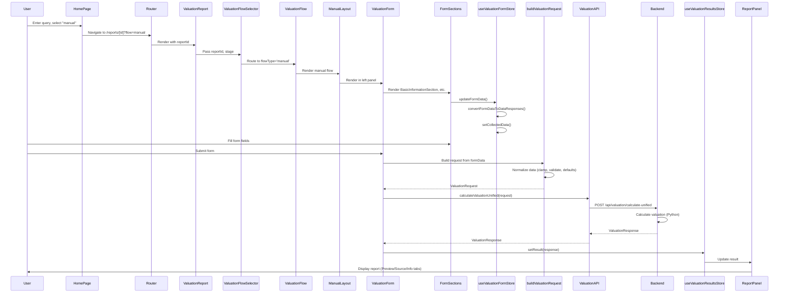
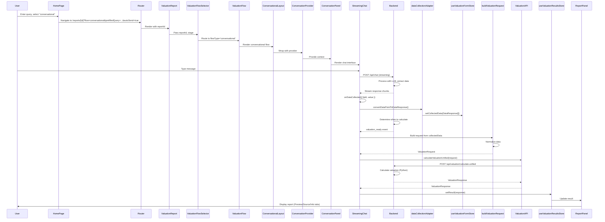
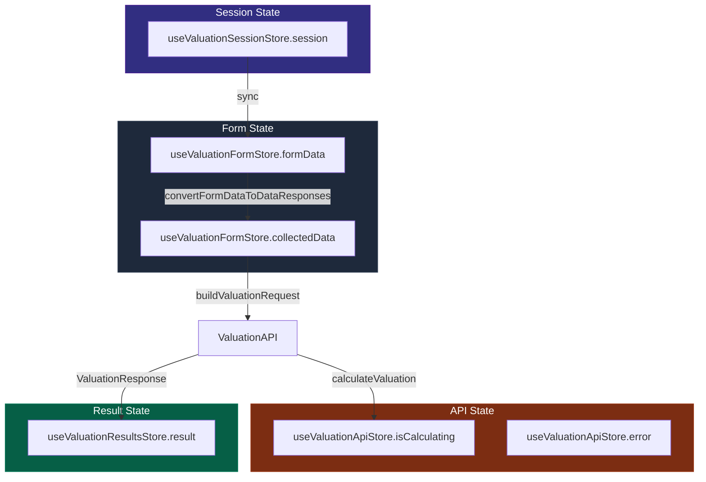
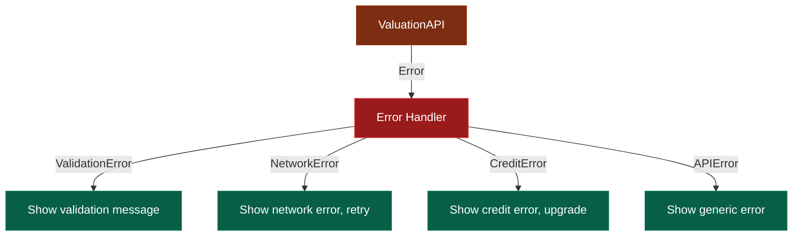

# Complete Flow Documentation

**Purpose**: Document the complete user flows from home page to report generation  
**Last Updated**: December 2025

---

## Overview

The valuation tester frontend supports two main flows:
1. **Manual Flow**: User fills out form manually
2. **Conversational Flow**: User chats with AI to collect data

Both flows converge to the same data collection pipeline and use the same backend API for calculations.

---

## Flow 1: Home → Manual Flow → Report

### Sequence Diagram



### Detailed Flow

#### Step 1: Home Page Entry

**File**: `app/home/page.tsx` → `components/pages/HomePage.tsx`

**User Actions**:
1. User enters business type query (e.g., "SaaS company")
2. User selects "manual" mode (toggle button)
3. User clicks submit or presses Enter

**Code Flow**:
```typescript
handleQuerySubmit() {
  const newReportId = generateReportId()
  const url = `/reports/${newReportId}?flow=manual&prefilledQuery=${query}`
  router.push(url)
}
```

#### Step 2: Report Page Initialization

**File**: `app/reports/[id]/page.tsx` → `components/ValuationReport.tsx`

**Process**:
1. Extract `reportId` from URL params
2. Validate reportId format
3. Initialize session via `ValuationSessionManager`
4. Determine flow type from session (`currentView: 'manual'`)
5. Render `ValuationFlowSelector` with appropriate stage

#### Step 3: Flow Selection

**File**: `components/ValuationFlowSelector.tsx`

**Process**:
1. Check session `currentView` → `'manual'`
2. Lazy load `ValuationFlow` component
3. Pass `flowType='manual'` to `ValuationFlow`

#### Step 4: Manual Flow Rendering

**File**: `features/valuation/components/ValuationFlow.tsx`

**Process**:
1. Check `flowType === 'manual'`
2. Lazy load `ManualLayout` component
3. Pass `reportId` and `onComplete` callback

#### Step 5: Manual Layout Setup

**File**: `features/manual/components/ManualLayout.tsx`

**Layout Structure**:
- **Left Panel** (50% width): `ValuationForm`
- **Right Panel** (50% width): `ReportPanel`
- **Toolbar**: `ValuationToolbar` (tabs, download, refresh, fullscreen)

**State Management**:
- Panel width state (responsive)
- Tab state (Preview/Source/Info)
- Fullscreen state

#### Step 6: Form Rendering

**File**: `components/ValuationForm/ValuationForm.tsx`

**Form Sections**:
1. `BasicInformationSection` - Business type, company name, founding year, country
2. `FinancialDataSection` - Revenue, EBITDA
3. `HistoricalDataSection` - Historical financial years
4. `OwnershipStructureSection` - Employees, owners, shares
5. `FormSubmitSection` - Submit button

**Data Flow**:
```typescript
// User types in form field
FormSection -> updateFormData({ field: value })
  -> useValuationFormStore.formData updated
  -> convertFormDataToDataResponses(formData)
  -> DataResponse[]
  -> setCollectedData(dataResponses)
  -> useValuationFormStore.collectedData updated
```

#### Step 7: Form Submission

**File**: `components/ValuationForm/hooks/useValuationFormSubmission.ts`

**Process**:
1. Validate form data (employee count, etc.)
2. Convert `formData` to `DataResponse[]` via `convertFormDataToDataResponses()`
3. Sync to `useValuationFormStore.collectedData`
4. Build `ValuationRequest` via `buildValuationRequest(formData)`
5. Call `calculateValuation(request)` from `useValuationApiStore`
6. Store result in `useValuationResultsStore`

**Code**:
```typescript
const handleSubmit = async (e: React.FormEvent) => {
  e.preventDefault()
  // Validate
  // Convert to DataResponse[]
  const dataResponses = convertFormDataToDataResponses(formData)
  setCollectedData(dataResponses)
  // Build request
  const request = buildValuationRequest(formData)
  // Calculate
  const result = await calculateValuation(request)
  setResult(result)
}
```

#### Step 8: Data Normalization

**File**: `src/utils/buildValuationRequest.ts`

**Normalization Rules**:
- Year validation (2000-2100)
- Recurring revenue clamping (0.0-1.0)
- Company name trimming
- Country code uppercase
- Industry/business model defaults
- Financial data merging
- Historical data filtering
- Sole trader handling

**No Calculations**: ✅ Only normalization, no valuation calculations

#### Step 9: API Call

**File**: `src/services/api/valuation/ValuationAPI.ts`

**Process**:
1. `calculateValuationUnified(request)` called
2. Adds `dataSource: 'manual'` to request
3. POST to `/api/valuation/calculate-unified`
4. Backend (Node.js) proxies to Python valuation engine
5. Python calculates valuation
6. Returns `ValuationResponse`

#### Step 10: Result Display

**File**: `src/features/conversational/components/ReportPanel.tsx`

**Tabs**:
- **Preview**: `Results` component (HTML report renderer)
- **Source**: `HTMLView` component (raw HTML)
- **Info**: `ValuationInfoPanel` component (calculation breakdown)

**Data Source**: `useValuationResultsStore.result`

---

## Flow 2: Home → Conversational Flow → Report

### Sequence Diagram



### Detailed Flow

#### Step 1: Home Page Entry

**Same as Manual Flow**, but user selects "conversational" mode.

**URL**: `/reports/[id]?flow=conversational&prefilledQuery=...&autoSend=true`

#### Step 2-4: Report Page → Flow Selection → Conversational Flow

**Same as Manual Flow**, but routes to `ConversationalLayout`.

#### Step 5: Conversational Layout Setup

**File**: `features/conversational/components/ConversationalLayout.tsx`

**Layout Structure**:
- **Left Panel**: `ConversationPanel` (contains `StreamingChat`)
- **Right Panel**: `ReportPanel`
- **Toolbar**: `ValuationToolbar`

**Context Provider**:
- Wrapped in `ConversationProvider` for conversation state management

#### Step 6: Chat Interface

**File**: `components/StreamingChat.tsx`

**Process**:
1. User types message
2. Message sent to backend `/api/chat` endpoint
3. Backend streams response chunks
4. As data is extracted, `onDataCollected({ field, value })` is called

#### Step 7: Data Collection

**File**: `src/utils/dataCollectionAdapter.ts`

**Process**:
```typescript
onDataCollected({ field: 'company_name', value: 'Acme Corp' })
  -> convertDataPointToDataResponse({ field, value })
  -> DataResponse = {
      fieldId: 'company_name',
      value: 'Acme Corp',
      method: 'conversational',
      confidence: 0.9,
      source: 'ai_extraction',
      timestamp: Date
    }
  -> setCollectedData([...collectedData, dataResponse])
  -> useValuationFormStore.collectedData updated
```

#### Step 8: Valuation Trigger

**Process**:
- Backend determines when enough data is collected
- Sends `valuation_ready` event via stream
- Frontend triggers calculation

#### Step 9-10: Same as Manual Flow

**Data Normalization → API Call → Result Display**

Same process as manual flow, but uses `collectedData` (DataResponse[]) instead of `formData`.

---

## Unified Data Collection Pipeline

### Data Convergence Point

Both flows converge at `useValuationFormStore.collectedData`:

```mermaid
flowchart TD
    subgraph ManualFlow[Manual Flow]
        MF[ValuationForm]
        MF -->|formData| CF1[convertFormDataToDataResponses]
        CF1 -->|DataResponse[]| CDS[useValuationFormStore.collectedData]
    end
    
    subgraph ConversationalFlow[Conversational Flow]
        CC[StreamingChat]
        CC -->|onDataCollected| CF2[dataCollectionAdapter]
        CF2 -->|DataResponse[]| CDS
    end
    
    subgraph UnifiedPipeline[Unified Pipeline]
        CDS -->|collectedData| BVR[buildValuationRequest]
        BVR -->|ValuationRequest| API[ValuationAPI.calculateValuationUnified]
        API -->|POST /api/valuation/calculate-unified| BE[Backend]
        BE -->|ValuationResponse| RS[useValuationResultsStore.result]
        RS -->|result| RP[ReportPanel]
    end
    
    style ManualFlow fill:#1e293b,stroke:#334155,color:#fff
    style ConversationalFlow fill:#1e293b,stroke:#334155,color:#fff
    style UnifiedPipeline fill:#065f46,stroke:#047857,color:#fff
```

### Key Files

**Data Collection**:
- `src/components/ValuationForm/` - Manual form
- `src/components/StreamingChat.tsx` - Conversational chat
- `src/utils/dataCollectionAdapter.ts` - Chat data adapter
- `src/components/ValuationForm/utils/convertFormDataToDataResponses.ts` - Form data converter

**Data Normalization**:
- `src/utils/buildValuationRequest.ts` - Unified request builder

**API Layer**:
- `src/services/api/valuation/ValuationAPI.ts` - API client
- `src/store/useValuationApiStore.ts` - API state

**Display Layer**:
- `src/features/conversational/components/ReportPanel.tsx` - Report display
- `src/components/results/Results.tsx` - HTML renderer
- `src/components/ValuationInfoPanel.tsx` - Info tab

---

## Data Structures

### ValuationFormData

```typescript
interface ValuationFormData {
  company_name?: string
  country_code?: string
  industry?: string
  business_model?: string
  founding_year?: number
  business_type_id?: string
  business_type?: string
  revenue?: number
  ebitda?: number
  current_year_data?: YearData
  historical_years_data?: YearData[]
  number_of_employees?: number
  number_of_owners?: number
  recurring_revenue_percentage?: number
  shares_for_sale?: number
  comparables?: ComparableCompany[]
}
```

### DataResponse

```typescript
interface DataResponse {
  fieldId: string
  value: string | number | boolean
  method: 'manual_form' | 'conversational' | 'registry' | 'file_upload'
  confidence: number // 0.0 to 1.0
  source: 'user_input' | 'ai_extraction' | 'registry' | 'file'
  timestamp: Date
  metadata?: Record<string, unknown>
}
```

### ValuationRequest

```typescript
interface ValuationRequest {
  company_name: string
  country_code: string
  industry: string
  business_model: string
  founding_year: number
  current_year_data: YearData
  historical_years_data: YearData[]
  number_of_employees?: number
  number_of_owners?: number
  recurring_revenue_percentage: number
  use_dcf: boolean
  use_multiples: boolean
  projection_years: number
  comparables?: ComparableCompany[]
  business_type_id?: string
  business_type?: string
  shares_for_sale: number
  business_context?: BusinessContext
}
```

### ValuationResponse

```typescript
interface ValuationResponse {
  valuation_id: string
  company_name: string
  equity_value_low: number
  equity_value_mid: number
  equity_value_high: number
  confidence_score: number
  methodology: string
  html_report: string
  transparency?: TransparencyData
  // ... more fields
}
```

---

## Entry Points

### 1. Home Page
- **Route**: `/` or `/home`
- **Component**: `components/pages/HomePage.tsx`
- **Actions**: Query input, mode selection, navigation

### 2. New Report
- **Route**: `/reports/new`
- **Component**: `app/reports/new/page.tsx`
- **Actions**: Generate new reportId, redirect to report page

### 3. Existing Report
- **Route**: `/reports/[id]`
- **Component**: `app/reports/[id]/page.tsx` → `components/ValuationReport.tsx`
- **Actions**: Restore session, render appropriate flow

---

## Exit Points

### 1. Report Display
- **Component**: `ReportPanel`
- **Tabs**: Preview, Source, Info
- **Data**: `useValuationResultsStore.result`

### 2. PDF Download
- **Component**: `ValuationToolbar` → `useValuationToolbarDownload`
- **Process**: Downloads PDF from backend
- **Endpoint**: Backend generates PDF, frontend downloads

### 3. Report Sharing
- **Component**: `ValuationToolbar`
- **Process**: Share report URL (future feature)

---

## State Management Flow



---

## Key Architectural Decisions

### 1. Unified Data Collection Pipeline ✅

**Decision**: Both flows converge to same `DataResponse[]` format  
**Benefit**: Single source of truth, consistent data handling  
**Implementation**: `convertFormDataToDataResponses()` and `dataCollectionAdapter`

### 2. Data Normalization Before API ✅

**Decision**: Normalize data in `buildValuationRequest()` before sending to backend  
**Benefit**: Consistent data format, reduces backend validation errors  
**Implementation**: `src/utils/buildValuationRequest.ts`

### 3. No Frontend Calculations ✅

**Decision**: All calculations in Python backend  
**Benefit**: Single source of truth, bank-grade accuracy  
**Implementation**: Frontend only collects data and displays results

### 4. Modular Form Sections ✅

**Decision**: Split ValuationForm into sections  
**Benefit**: Single Responsibility Principle, easier maintenance  
**Implementation**: `src/components/ValuationForm/sections/`

### 5. Split State Management ✅

**Decision**: Separate stores for form, API, results, session  
**Benefit**: Clear separation of concerns, easier testing  
**Implementation**: `src/store/useValuation*Store.ts`

---

## Error Handling Flow



---

## Performance Optimizations

### 1. Lazy Loading ✅
- `ValuationFlow` components lazy loaded
- `ManualLayout` and `ConversationalLayout` lazy loaded
- Reduces initial bundle size

### 2. Debounced Sync ✅
- Form data sync debounced (500ms)
- Prevents excessive updates
- Reduces API calls

### 3. Code Splitting ✅
- Route-based code splitting
- Feature-based code splitting
- Component lazy loading

---

## Security Considerations

### 1. No Sensitive Data in Frontend ✅
- No API keys exposed
- No calculation logic exposed
- All sensitive operations in backend

### 2. Input Validation ✅
- Frontend validation for UX
- Backend validation for security
- Type safety with TypeScript

### 3. Auth Integration ✅
- Guest and logged-in users supported
- Credit tracking
- Session management

---

## Testing Strategy

### Unit Tests
- Form sections
- Data transformation utilities
- State management stores

### Integration Tests
- Form submission flow
- API call flow
- Data collection pipeline

### E2E Tests
- Complete manual flow
- Complete conversational flow
- Report generation

---

## Future Enhancements

### Phase 2 Features (TODOs)
1. Report persistence API
2. File upload backend integration
3. Company lookup API
4. Document parsing API

### Phase 3 Features
1. Report sharing
2. Report comparison
3. Historical valuations
4. Export formats (Excel, CSV)

---

**Last Updated**: December 2025  
**Next Review**: Q1 2026
