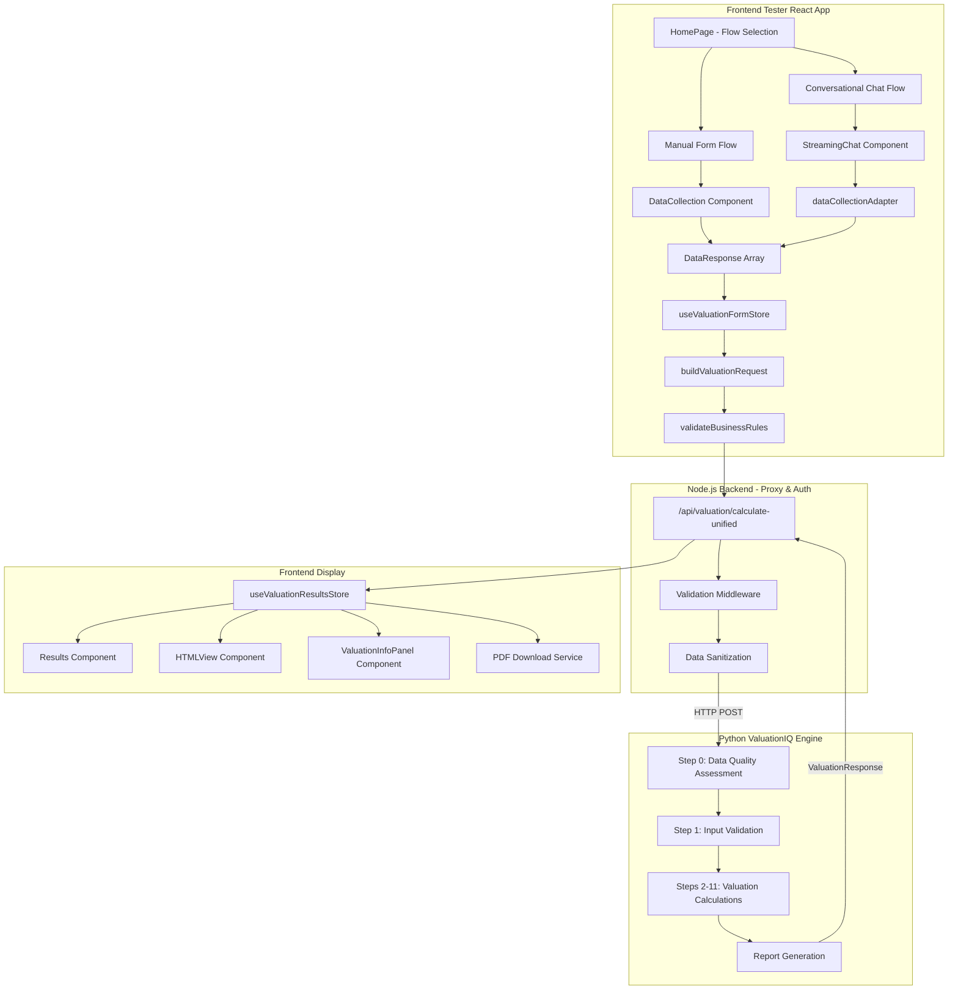

# Data Flow Architecture
## Valuation Tester Frontend → Python ValuationIQ Engine

**Purpose**: Document the complete data flow from user input to valuation results

**Last Updated**: December 13, 2025

---

## Overview

The valuation tester frontend is a **pure data collection and report display interface**. It collects user input through two flows (manual or conversational), normalizes the data, and sends it to the Python ValuationIQ engine for calculation.

**Core Principle**: The frontend does NOT perform any valuation calculations. All calculations, report generation, and business logic happen in the Python backend.

---

## Architecture Diagram



---

## Data Flow Stages

### Stage 1: Data Collection

#### Manual Flow
```typescript
// User fills form → DataCollection component
DataCollection Component
  ↓ produces
DataResponse[] = [
  {
    fieldId: "company_name",
    value: "Acme Corp",
    method: "manual_form",
    confidence: 1.0,
    source: "user_input",
    timestamp: Date
  },
  // ... more fields
]
```

#### Conversational Flow
```typescript
// User chats → StreamingChat component
StreamingChat onDataCollected(field, value)
  ↓ converts via
dataCollectionAdapter.convertDataPointToDataResponse()
  ↓ produces
DataResponse = {
  fieldId: "company_name",
  value: "Acme Corp",
  method: "conversational",
  confidence: 0.9,
  source: "ai_extraction",
  timestamp: Date
}
```

**Result**: Both flows produce the same `DataResponse[]` format

### Stage 2: Data Storage

```typescript
// Both flows sync to the same stores
useValuationFormStore.setCollectedData(dataResponses)
useValuationFormStore.updateFormData(convertDataResponsesToFormData(dataResponses))

// Result: Data available in two formats
- collectedData: DataResponse[]  // For tracking collection metadata
- formData: Partial<ValuationFormData>  // For valuation request
```

### Stage 3: Data Normalization

**Location**: [`useValuationApiStore.ts:328-398`](../../../apps/upswitch-valuation-tester/src/store/useValuationApiStore.ts)

**Function**: `buildValuationRequest(sourceData)`

**Normalization Rules**:

1. **Year Validation**:
   ```typescript
   currentYear = Math.min(Math.max(year || currentYear, 2000), 2100)
   foundingYear = Math.min(Math.max(founding_year || currentYear - 5, 1900), 2100)
   ```

2. **Recurring Revenue Clamping**:
   ```typescript
   recurring_revenue_percentage = Math.min(Math.max(value || 0.0, 0.0), 1.0)
   ```

3. **Company Name**:
   ```typescript
   company_name = name?.trim() || 'Unknown Company'
   ```

4. **Country Code**:
   ```typescript
   country_code = (code || 'BE').toUpperCase().substring(0, 2)
   ```

5. **Industry/Business Model**:
   ```typescript
   industry = industry || 'services'
   business_model = business_model || 'services'
   ```

6. **Financial Data Merge**:
   ```typescript
   // Merge top-level revenue/ebitda with current_year_data
   current_year_data: {
     year: currentYear,
     revenue: Math.max(revenue || current_year_data?.revenue || 100000, 1),
     ebitda: ebitda ?? current_year_data?.ebitda ?? 20000,
     // Optional: total_assets, total_debt, cash
   }
   ```

7. **Historical Data Filtering**:
   ```typescript
   historical_years_data = data?.filter(year => 
     year.ebitda !== undefined && year.ebitda !== null
   ).map(year => ({
     year: Math.min(Math.max(year.year, 2000), 2100),
     revenue: Math.max(year.revenue || 0, 1),
     ebitda: year.ebitda
   }))
   ```

8. **Sole Trader Handling**:
   ```typescript
   // Sole traders don't have employees/owners
   number_of_employees = business_type === 'sole-trader' ? undefined : employees
   number_of_owners = business_type === 'sole-trader' ? undefined : owners
   ```

9. **Business Context Mapping**:
   ```typescript
   business_context = {
     dcfPreference: _internal_dcf_preference,
     multiplesPreference: _internal_multiples_preference,
     ownerDependencyImpact: _internal_owner_dependency_impact,
     keyMetrics: _internal_key_metrics,
     typicalEmployeeRange: _internal_typical_employee_range,
     typicalRevenueRange: _internal_typical_revenue_range
   }
   ```

**Important**: These are **data preparation** operations, NOT valuation calculations.

### Stage 4: Business Rule Validation

**Location**: [`utils/valuationValidation.ts`](../../../apps/upswitch-valuation-tester/src/utils/valuationValidation.ts)

**Validations Performed**:

1. **EBITDA <= Revenue**:
   ```typescript
   if (ebitda > revenue) {
     error: 'EBITDA cannot exceed revenue'
   }
   ```

2. **Chronological Historical Years**:
   ```typescript
   if (years not chronological) {
     error: 'Historical years must be in chronological order'
   }
   ```

3. **Founding Year Reasonableness**:
   ```typescript
   if (founding_year > currentYear) {
     error: 'Founding year cannot be in the future'
   }
   if (companyAge > 200) {
     warning: 'Founding year seems unusually old'
   }
   ```

4. **Revenue Per Employee Sanity Check**:
   ```typescript
   if (revenuePerEmployee > €10M) {
     warning: 'Revenue per employee seems very high'
   }
   if (revenuePerEmployee < €10K) {
     warning: 'Revenue per employee seems very low'
   }
   ```

**Result**: Errors thrown before API call for better UX

### Stage 5: API Call to Node.js Backend

**API Endpoint**: `/api/valuation/calculate-unified`

**Request Format** (`ValuationRequest`):
```typescript
{
  // REQUIRED
  company_name: string,
  country_code: string,  // 2-letter ISO
  industry: string,
  business_model: string,
  founding_year: number,  // 1900-2100
  current_year_data: {
    year: number,
    revenue: number,  // > 0
    ebitda: number
  },
  
  // OPTIONAL
  historical_years_data: YearDataInput[],
  number_of_employees: number,
  number_of_owners: number,  // Default: 1
  recurring_revenue_percentage: number,  // 0.0-1.0
  business_type_id: string,
  business_context: object,
  comparables: array,
  use_dcf: boolean,  // Default: true
  use_multiples: boolean,  // Default: true
  projection_years: number  // Default: 10
}
```

### Stage 6: Node.js Validation & Proxy

**Node.js Backend Operations**:
1. **Authentication**: Verify user/guest session
2. **Credit Check**: Ensure user has credits
3. **Sanitization**: Clean inputs (XSS prevention)
4. **Validation**: Validate request structure
5. **Logging**: Track analytics
6. **Proxy**: Forward to Python engine

**No calculation logic in Node.js** - pure proxy layer.

### Stage 7: Python Valuation Engine

#### Step 0: Data Quality Assessment

**Purpose**: Evaluate data completeness and determine methodology

**Checks**:
- Completeness score (0-100)
- Historical data availability (≥3 years for DCF)
- Revenue threshold (≥€5M recommended for DCF)
- Data quality across 5 dimensions

**Output**:
- `dcf_eligible`: boolean
- `multiples_method`: "primary" or "cross_check"
- `quality_score`: 0-100
- `warnings`: array
- `recommendations`: array

#### Step 1: Input Validation & Normalization

**Purpose**: Validate and normalize financial metrics

**Validations**:
- Revenue > 0
- EBITDA validity
- Company info completeness
- Industry classification
- Historical years chronological

**Normalizations**:
- EBITDA adjustments (if needed)
- Margin calculations (EBITDA margin, net margin)
- Weighted metrics (if historical data available)

**Output**:
- Validated financial profile
- Normalized metrics
- Calculated margins
- Company profile

#### Steps 2-11: Valuation Calculations

**Steps**:
- Step 2: Market Context
- Step 2.5: Multiple Calibration
- Step 3: Business Type Analysis
- Step 4: DCF Calculation (if eligible)
- Step 5: Market Multiples
- Step 6: Methodology Selection
- Step 7: Risk Adjustments
- Step 8: Final Value Calculation
- Step 9: Sensitivity Analysis
- Step 10: Range Methodology
- Step 11: Final Synthesis

**Result**: `ValuationResponse` with complete valuation data

### Stage 8: Response Processing

**Python Returns** (`ValuationResponse`):
```python
{
  valuation_id: str,
  company_name: str,
  estimated_value: Decimal,
  value_range: {
    lower_bound: Decimal,
    upper_bound: Decimal
  },
  methodology: str,
  html_report: str,  # Complete HTML report
  info_tab_html: str,  # Detailed methodology HTML
  transparency: {
    calculation_steps: dict,
    methodology_statement: str,
    assumptions: list,
    adjustments_applied: list
  },
  # ... more fields
}
```

### Stage 9: Frontend Display

**Display Components** (No Calculation Logic):

1. **Results Component**:
   - Renders `html_report` from Python
   - Pure display, no processing
   - Location: Preview tab

2. **HTMLView Component**:
   - Shows raw HTML source
   - Copy to clipboard functionality
   - Location: Source tab

3. **ValuationInfoPanel Component**:
   - Renders `info_tab_html` from Python
   - Shows methodology details
   - Location: Info tab

4. **PDF Download**:
   - Downloads PDF from Python backend
   - No frontend generation

---

## Python Engine Contract

### Required Fields

```typescript
interface MinimalValuationRequest {
  // Company (REQUIRED)
  company_name: string  // 1-200 chars, trimmed
  country_code: string  // 2-letter ISO (e.g., "BE", "DE", "US")
  industry: string      // Industry classification
  business_model: string  // BusinessModel enum or string
  founding_year: number  // 1900-2100
  
  // Financial (REQUIRED)
  current_year_data: {
    year: number  // 2000-2100
    revenue: number  // > 0, REQUIRED
    ebitda: number  // Can be negative, REQUIRED
  }
}
```

### Optional Fields

```typescript
interface OptionalValuationFields {
  // Historical data (enables DCF if ≥3 years)
  historical_years_data?: YearDataInput[]
  
  // Company details
  number_of_employees?: number  // ≥ 0
  number_of_owners?: number  // ≥ 1, default: 1
  recurring_revenue_percentage?: number  // 0.0-1.0
  
  // Business type integration
  business_type_id?: string  // PostgreSQL business type ID
  business_type?: string  // "company" | "sole-trader"
  
  // Preferences
  business_context?: {
    dcfPreference?: number  // 0-1
    multiplesPreference?: number  // 0-1
    ownerDependencyImpact?: number  // 0-1
    keyMetrics?: string[]
    typicalEmployeeRange?: { min: number, max: number }
    typicalRevenueRange?: { min: number, max: number }
  }
  
  // Valuation preferences
  use_dcf?: boolean  // Default: true
  use_multiples?: boolean  // Default: true
  projection_years?: number  // 5-15, default: 10
  
  // Market context overrides
  government_bond_yield?: number  // 0.0-0.5
  long_term_gdp_growth?: number  // -0.1-0.5
  
  // Comparable companies
  comparables?: Array<{
    name: string
    ev_ebitda_multiple?: number
    ev_revenue_multiple?: number
    pe_ratio?: number
  }>
}
```

### Field Validations (Python)

**Pydantic Validators**:
- `company_name`: 1-200 characters
- `country_code`: 2-letter uppercase ISO
- `industry`: 1-100 characters
- `business_model`: Enum or mapped string
- `founding_year`: 1900-2100
- `current_year_data.year`: 2000-2100
- `current_year_data.revenue`: > 0 (Decimal)
- `current_year_data.ebitda`: Any Decimal value
- `historical_years_data`: Max 10 years, chronological
- `number_of_employees`: ≥ 0
- `number_of_owners`: 1-100
- `recurring_revenue_percentage`: 0.0-1.0 (Decimal)

---

## Data Normalization Rules

### Frontend Normalization (Pre-Send)

**Purpose**: Prepare data for Python engine, ensure valid types and ranges

**Rules Applied by `buildValuationRequest()`**:

1. **Type Conversions**:
   - String → Number: `Number(value)`
   - Ensure integers for years
   - Ensure decimals for financial values

2. **Range Clamping**:
   - Years: 2000-2100 (current_year_data)
   - Founding year: 1900-2100
   - Recurring revenue: 0.0-1.0
   - Shares for sale: 0-100

3. **Defaults**:
   - company_name: "Unknown Company" (if empty)
   - country_code: "BE" (Belgium)
   - industry: "services"
   - business_model: "services"
   - founding_year: current_year - 5
   - number_of_owners: 1
   - shares_for_sale: 100
   - use_dcf: true
   - use_multiples: true
   - projection_years: 10

4. **Data Merging**:
   - Top-level `revenue` → `current_year_data.revenue`
   - Top-level `ebitda` → `current_year_data.ebitda`
   - `formData` + `sessionData` merge

5. **Filtering**:
   - Historical years: Remove entries without EBITDA
   - Invalid years: Clamp to 2000-2100

### Python Normalization (Post-Receive)

**Function**: `normalize_request_fields()` in Python

**Operations**:
1. Normalize employee count field names
2. Normalize revenue field names
3. Set default methodology ("HYBRID")
4. Auto-enable Phase 2 features based on data quality

---

## Validation Layers

### Layer 1: Frontend Validation (Immediate UX)

**Location**: `utils/valuationValidation.ts`

**Checks**:
- Required fields present
- EBITDA <= Revenue
- Historical years chronological
- Founding year reasonable
- Revenue per employee sanity check
- Recurring revenue percentage 0-1

**Benefit**: Catch errors before API call, better UX

### Layer 2: Node.js Validation (Security)

**Middleware**: `validation.ts`

**Checks**:
- Input sanitization (XSS prevention)
- Request structure validation
- Authentication/authorization
- Credit availability

**Benefit**: Security layer, prevent malicious input

### Layer 3: Python Validation (Business Logic)

**Step 0 & Step 1**:
- Pydantic schema validation
- Business rule validation
- Data quality assessment
- Methodology eligibility

**Benefit**: Comprehensive validation before calculation

---

## Response Flow

### Python Response Structure

```python
class ValuationResponse(BaseModel):
    valuation_id: str
    company_name: str
    estimated_value: Decimal
    value_range: ValueRange
    methodology: str
    
    # HTML Reports (Generated by Python)
    html_report: str  # Main report HTML
    info_tab_html: str  # Detailed methodology HTML
    
    # Transparency Data
    transparency: TransparencyData
    modular_system: ModularSystemData
    
    # Metrics
    primary_metric: str
    ebitda_margin: Optional[Decimal]
    revenue_growth: Optional[Decimal]
    
    # ... more fields
```

### Frontend Display

**Store**: `useValuationResultsStore`

**Components**:
1. **Results** (Preview Tab):
   - Displays `result.html_report`
   - No processing, pure render
   - Uses `dangerouslySetInnerHTML` (Python HTML is trusted)

2. **HTMLView** (Source Tab):
   - Displays raw `result.html_report`
   - Copy to clipboard
   - No processing

3. **ValuationInfoPanel** (Info Tab):
   - Displays `result.info_tab_html`
   - Shows methodology details
   - No processing

4. **PDF Download**:
   - Calls `/api/valuation/download-pdf/${valuation_id}`
   - Node.js proxies to Python
   - Python generates PDF from stored calculation

---

## No Calculation Logic in Frontend

### What Frontend Does NOT Do

- Calculate enterprise value
- Calculate multiples
- Apply risk adjustments
- Generate HTML reports
- Perform DCF calculations
- Calculate value ranges
- Apply discounts
- Determine methodology

### What IS in Frontend (All Acceptable)

**Data Preparation** (Not Calculation):
- Type conversions: `Number(string)`, `String(number)`
- Range clamping: `Math.min(Math.max(value, min), max)`
- String operations: `.trim()`, `.toUpperCase()`, `.substring()`
- Array operations: `.filter()`, `.map()`
- Defaults: `value || defaultValue`

**UI Calculations** (Not Valuation):
- Scrollbar width: `window.innerWidth - document.documentElement.clientWidth`
- Progress percentage: `(completed / total) * 100`
- Date math: `new Date().getFullYear()`
- ID generation: `Math.random().toString(36)`

**All of these are appropriate for a data collection frontend.**

---

## Testing Strategy

### Unit Tests

Test data normalization:
```typescript
describe('buildValuationRequest', () => {
  it('should clamp years to 2000-2100', () => {
    const result = buildValuationRequest({
      current_year_data: { year: 2500, revenue: 100000, ebitda: 20000 }
    })
    expect(result.current_year_data.year).toBe(2100)
  })
  
  it('should merge top-level revenue', () => {
    const result = buildValuationRequest({
      revenue: 500000,
      current_year_data: { year: 2024, revenue: 0, ebitda: 100000 }
    })
    expect(result.current_year_data.revenue).toBe(500000)
  })
})
```

Test validation:
```typescript
describe('validateBusinessRules', () => {
  it('should error when EBITDA > Revenue', () => {
    const errors = validateBusinessRules({
      revenue: 100000,
      ebitda: 150000
    })
    expect(errors).toHaveLength(1)
    expect(errors[0].field).toBe('ebitda')
  })
  
  it('should error when historical years not chronological', () => {
    const errors = validateBusinessRules({
      historical_years_data: [
        { year: 2023, revenue: 100000, ebitda: 20000 },
        { year: 2021, revenue: 90000, ebitda: 18000 }  // Wrong order
      ]
    })
    expect(errors).toHaveLength(1)
    expect(errors[0].field).toBe('historical_years_data')
  })
})
```

### Integration Tests

Test end-to-end flow:
```typescript
describe('Manual Flow Integration', () => {
  it('should collect data → normalize → send to Python → display results', async () => {
    // 1. Collect data
    const dataResponses = [
      { fieldId: 'company_name', value: 'Test Corp', ... },
      { fieldId: 'revenue', value: 1000000, ... },
      // ... more fields
    ]
    
    // 2. Store data
    useValuationFormStore.getState().setCollectedData(dataResponses)
    useValuationFormStore.getState().updateFormData(
      convertDataResponsesToFormData(dataResponses)
    )
    
    // 3. Calculate
    await useValuationApiStore.getState().calculateValuation()
    
    // 4. Verify result
    const result = useValuationResultsStore.getState().result
    expect(result).toBeDefined()
    expect(result.html_report).toBeDefined()
    expect(result.estimated_value).toBeGreaterThan(0)
  })
})
```

---

## Monitoring & Observability

### Logging Points

**Frontend Logging**:
```typescript
storeLogger.info('Data collected', { fieldCount, completeness })
storeLogger.info('Sending valuation request', { companyName, revenue })
storeLogger.info('Valuation response received', { valuationId, estimatedValue })
storeLogger.warn('Data quality warnings', { warnings })
storeLogger.error('Valuation failed', { error })
```

**Python Logging**:
- Step 0: Data quality assessment results
- Step 1: Validation and normalization results
- Each calculation step: Inputs, outputs, decisions
- Final: Valuation result summary

**Correlation IDs**: Track request through entire pipeline (Frontend → Node.js → Python)

---

## Error Handling

### Frontend Errors

**Validation Errors** (Before API call):
```typescript
try {
  const errors = getValidationErrors(formData)
  if (errors.length > 0) {
    throw new ValidationError(errors[0].message)
  }
} catch (error) {
  if (error instanceof ValidationError) {
    toast.error(error.message)
    return
  }
}
```

**API Errors** (After API call):
```typescript
try {
  const response = await backendAPI.calculateValuationUnified(request)
} catch (error) {
  if (error instanceof ValidationError) {
    // 400 - User input error
    toast.error('Please check your input data')
  } else if (error instanceof AuthenticationError) {
    // 401 - Auth error
    router.push('/login')
  } else if (error instanceof CreditError) {
    // 402 - No credits
    showCreditModal()
  } else {
    // 500 - Server error
    toast.error('Calculation failed. Please try again.')
  }
}
```

### Python Errors

**Step 0/1 Validation Errors**:
- 400: Invalid input data
- 422: Validation failed (specific field errors)

**Calculation Errors**:
- 500: Calculation logic error
- 503: External service unavailable

**All errors include**:
- Specific error message
- Field causing error (if applicable)
- Correlation ID for tracking

---

## Performance Targets

### Frontend
- Data collection: Instant (< 100ms)
- Data normalization: < 50ms
- API call initiation: < 10ms
- Result display: < 100ms (after response)

### Backend
- Node.js proxy: < 100ms
- Python Step 0: < 200ms
- Python Step 1: < 200ms
- Full calculation: < 5s (comprehensive)
- Quick valuation: < 1s

---

## Security Considerations

### Frontend
- No sensitive data stored in local storage
- All data sent over HTTPS
- Input sanitization before send
- XSS prevention (React escapes by default)

### Node.js
- Authentication required (user or guest)
- Credit check before calculation
- Input sanitization (validation middleware)
- Rate limiting
- CORS configuration

### Python
- Pydantic validation (prevents injection)
- Decimal arithmetic (prevents precision errors)
- Audit trail (immutable logs)
- Error boundaries (fails gracefully)

---

## Future Enhancements

### Planned Features
1. **File Upload**: P&L upload for auto data extraction
2. **Multi-year batch**: Upload multiple years at once
3. **Company data pre-fill**: Integrate with more registries
4. **Real-time validation**: Validate as user types
5. **Offline support**: Cache for offline data collection

### Architecture Considerations
- Keep frontend lightweight (target: < 30K LOC)
- Maintain zero calculation logic
- Preserve clear data flow
- Single responsibility for each component

---

## Conclusion

The valuation tester frontend follows a clean architecture:

1. **Data Collection**: Two flows (manual + conversational) with unified output
2. **Data Normalization**: Type conversions and range validation (NOT calculation)
3. **API Integration**: Pure proxy to Python engine
4. **Result Display**: Renders Python-generated HTML

**No calculation logic exists in the frontend** - all valuation logic is in the Python ValuationIQ engine.

**Data flow is clear and traceable** - from user input through normalization to Python to display.

**Architecture is sound** - ready for popup/subdomain deployment with minimal dependencies.

---

**Document Version**: 1.0  
**Last Updated**: December 13, 2025  
**Maintained By**: Frontend Team  
**Related Docs**: 
- [Architecture Overview](./ARCHITECTURE_OVERVIEW.md)
- [Component Structure](./COMPONENTS.md)
- [Python Engine Integration](../../upswitch-valuation-engine/docs/API.md)
