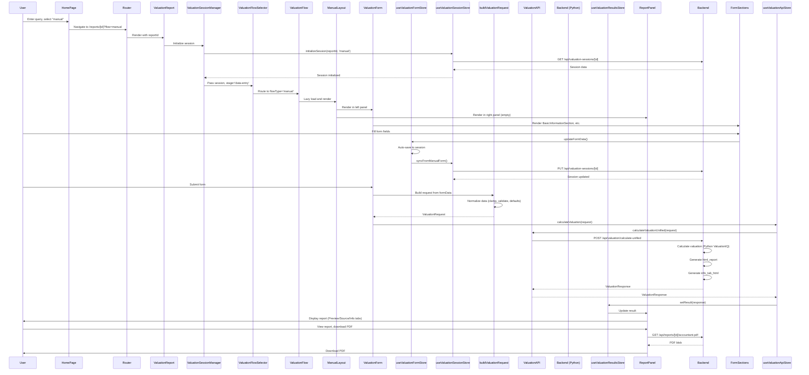
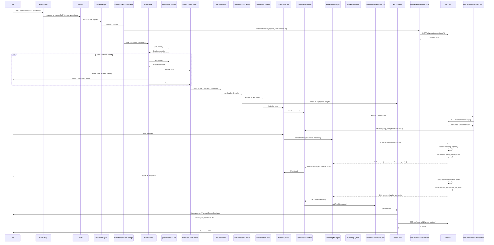
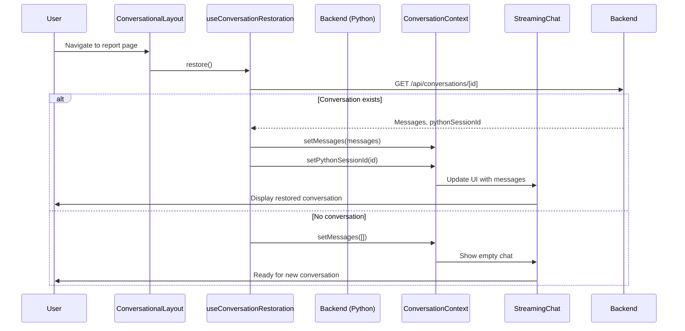
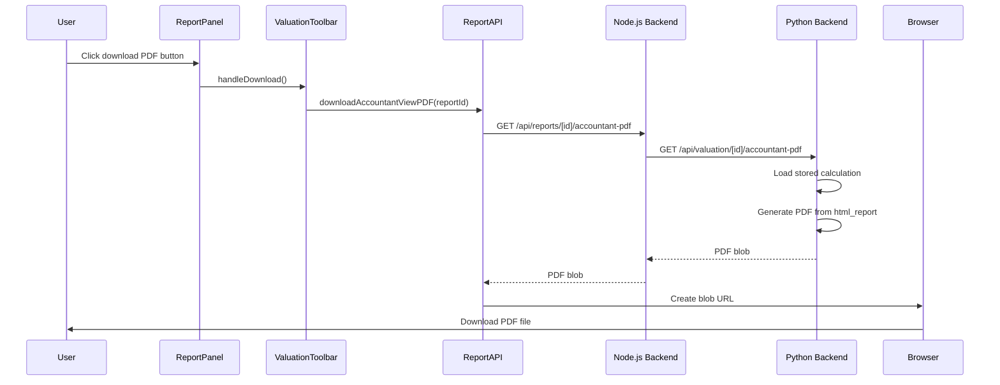
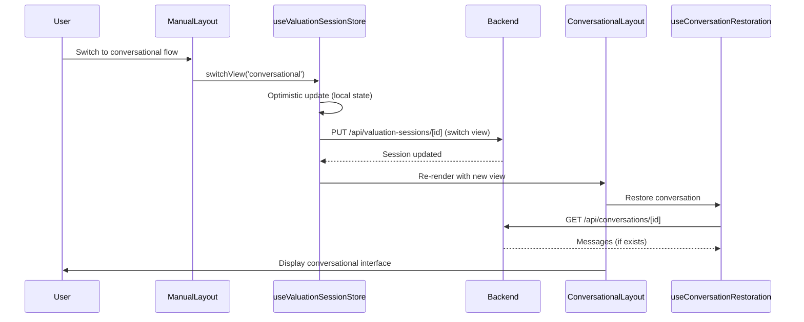
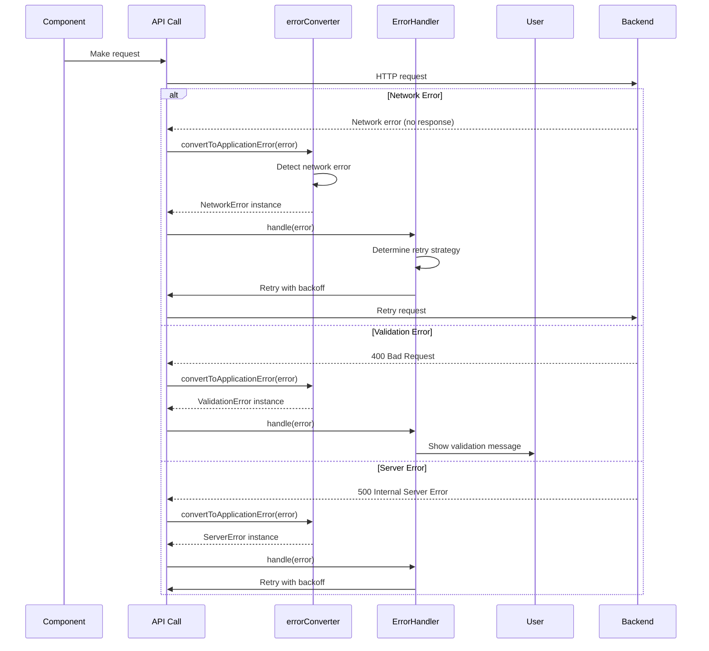
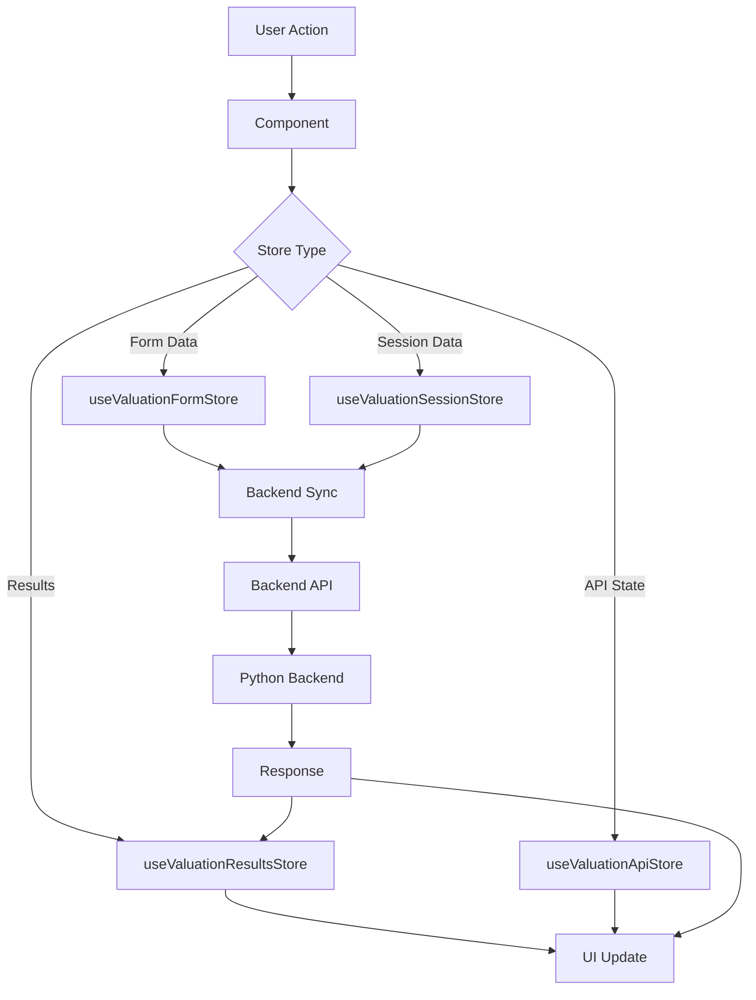

# Flow Sequence Diagrams

**Purpose**: Visual sequence diagrams for all user flows  
**Last Updated**: January 2025

---

## Overview

This document provides detailed sequence diagrams for all user flows in the valuation tester application, showing the complete interaction between components, stores, and backend services.

---

## Flow 1: Home → Manual Flow → Report

### Complete Sequence Diagram



### Key Components

1. **HomePage**: Entry point, query input
2. **ValuationReport**: Main container, session initialization
3. **ValuationSessionManager**: Session lifecycle management
4. **ManualLayout**: 2-panel layout (form + report)
5. **ValuationForm**: Form inputs, validation
6. **ReportPanel**: Report display (Preview/Source/Info tabs)

---

## Flow 2: Home → Conversational Flow → Report

### Complete Sequence Diagram



### Key Components

1. **CreditGuard**: Credit checking for guest users
2. **ConversationalLayout**: 2-panel layout (chat + report)
3. **ConversationPanel**: Chat interface wrapper
4. **StreamingChat**: Chat orchestrator
5. **StreamingManager**: SSE stream management
6. **ConversationContext**: Conversation state management

---

## Flow 3: Session Restoration

### Sequence Diagram



---

## Flow 4: PDF Download

### Sequence Diagram



---

## Flow 5: Flow Switching (Manual ↔ Conversational)

### Sequence Diagram



---

## Data Flow Architecture

### Manual Flow Data Flow

```
User Input (Form Fields)
    ↓
ValuationForm
    ↓
useValuationFormStore (Form State)
    ↓
useValuationSessionStore (Session Sync)
    ↓
Backend API (Session Persistence)
    ↓
buildValuationRequest (Data Transformation)
    ↓
ValuationAPI (API Call)
    ↓
Python Backend (Calculation)
    ↓
ValuationResponse (HTML Reports)
    ↓
useValuationResultsStore (Results State)
    ↓
ReportPanel (Display)
```

### Conversational Flow Data Flow

```
User Message
    ↓
StreamingChat
    ↓
StreamingManager (SSE Stream)
    ↓
Python Backend (AI Processing)
    ↓
SSE Events (Message Chunks, Data Updates)
    ↓
ConversationContext (State Management)
    ↓
StreamingChat (UI Update)
    ↓
Python Backend (Valuation Calculation)
    ↓
ValuationResponse (HTML Reports)
    ↓
useValuationResultsStore (Results State)
    ↓
ReportPanel (Display)
```

---

## Error Handling Flow

### Sequence Diagram



---

## State Management Flow

### Store Interaction



---

## Component Hierarchy

### Manual Flow

```
ValuationReport
  └── ValuationSessionManager
      └── ValuationFlowSelector
          └── ValuationFlow
              └── ManualLayout
                  ├── ValuationToolbar
                  ├── ValuationForm (Left Panel)
                  │   ├── BasicInformationSection
                  │   ├── FinancialMetricsSection
                  │   └── ...
                  └── ReportPanel (Right Panel)
                      ├── Preview Tab (Results)
                      ├── Source Tab (HTMLView)
                      └── Info Tab (ValuationInfoPanel)
```

### Conversational Flow

```
ValuationReport
  └── ValuationSessionManager
      └── CreditGuard
          └── ValuationFlowSelector
              └── ValuationFlow
                  └── ConversationalLayout
                      ├── ValuationToolbar
                      ├── ConversationPanel (Left Panel)
                      │   └── StreamingChat
                      │       ├── MessagesList
                      │       └── ChatInputForm
                      └── ReportPanel (Right Panel)
                          ├── Preview Tab (Results)
                          ├── Source Tab (HTMLView)
                          └── Info Tab (ValuationInfoPanel)
```

---

## Related Documentation

- [COMPLETE_FLOW_DOCUMENTATION.md](./COMPLETE_FLOW_DOCUMENTATION.md) - Detailed flow documentation
- [DATA_FLOW.md](./DATA_FLOW.md) - Data flow architecture
- [SESSION_RESTORATION_ARCHITECTURE.md](./SESSION_RESTORATION_ARCHITECTURE.md) - Session restoration details

---

**Last Updated**: January 2025  
**Maintainer**: Frontend Team

