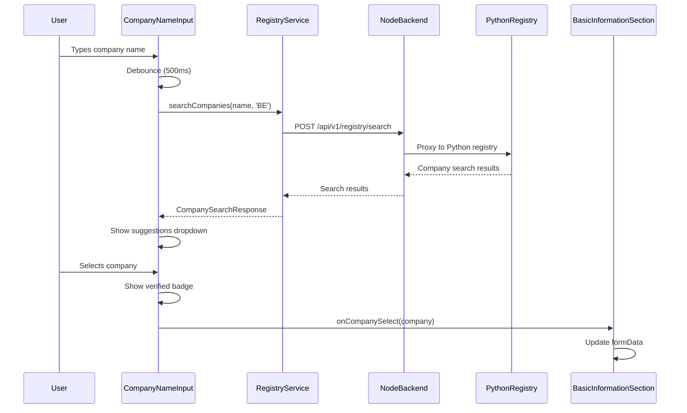
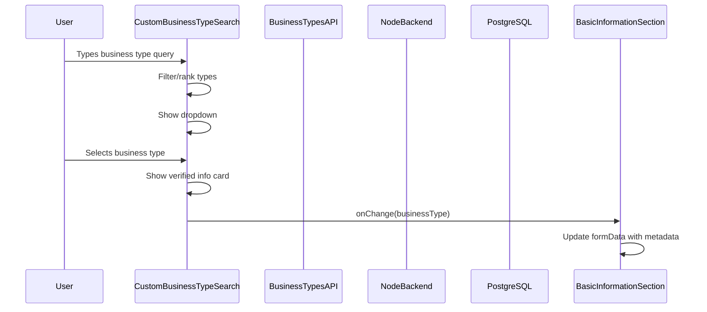

# KBO and Business Type Check Integration

**Date**: December 2025  
**Purpose**: Document KBO (Belgian Company Registry) and Business Type verification integration

---

## Summary

✅ **COMPLETED**: KBO check and Business Type verification are fully integrated and connected to backend APIs.

---

## KBO Company Name Verification

### Implementation

**Component**: `src/components/forms/CompanyNameInput.tsx`

**Features**:
- Real-time KBO registry search as user types
- Debounced search (500ms) to reduce API calls
- Shows search suggestions dropdown
- Displays verified company badge when exact match found
- Shows company summary card after selection
- Fetches company financial data when available

**Backend Connection**:
- Uses `registryService.searchCompanies()` → `/api/v1/registry/search`
- Node.js backend proxies to Python registry service
- KBO (Belgian Company Registry) lookup for BE companies

**Integration Points**:
- `BasicInformationSection.tsx` - Uses `CompanyNameInput` component
- `onCompanySelect` callback updates form data with registry information
- Registry data can be used to prefill form fields

### Flow



### Usage

```typescript
<CompanyNameInput
  value={formData.company_name || ''}
  onChange={(value) => updateFormData({ company_name: value })}
  countryCode={formData.country_code || 'BE'}
  onCompanySelect={(company) => {
    // Company verified in KBO registry
    updateFormData({
      company_name: company.company_name,
      // Can add more fields from registry data
    })
  }}
/>
```

---

## Business Type Verification

### Implementation

**Component**: `src/components/forms/CustomBusinessTypeSearch.tsx`

**Features**:
- Searchable dropdown with business types from PostgreSQL database
- Shows verified business type info card after selection
- Displays industry, category, icon, and metadata
- Fuzzy search with ranking
- Popular types highlighted
- Category grouping

**Backend Connection**:
- Uses `businessTypesApi` → `/api/business-types`
- Fetches business types from PostgreSQL database
- Includes metadata: DCF preference, multiples preference, owner dependency impact, etc.

**Integration Points**:
- `BasicInformationSection.tsx` - Uses `CustomBusinessTypeSearch` component
- `onChange` callback updates form data with business type metadata
- Business type metadata stored in form for backend submission

### Flow



### Verified Business Type Display

After selection, shows:
- ✅ Verified badge with icon
- Business type description
- Industry mapping
- Category
- Metadata (DCF preference, multiples preference, etc.)

### Usage

```typescript
<CustomBusinessTypeSearch
  value={formData.business_type_id}
  businessTypes={businessTypes}
  onChange={(businessType) => {
    updateFormData({
      business_type_id: businessType.id,
      business_type: businessType.title,
      industry: businessType.industry,
      // Store metadata for backend
      _internal_dcf_preference: businessType.dcfPreference,
      _internal_multiples_preference: businessType.multiplesPreference,
    })
  }}
/>
```

---

## lookupCompany() API Method

### Implementation

**File**: `src/services/api.ts`

**Purpose**: Programmatic company lookup (not just UI component)

**Features**:
- Uses registry service to search for companies
- Optionally fetches financial data
- Returns `CompanyLookupResult` with company information
- Connects to Node.js backend → Python registry

**Usage**:
```typescript
const result = await valuationAPI.lookupCompany('Acme Corp', 'BE')
// Returns: { name, industry, country, founding_year, employees, revenue, ... }
```

**Backend Flow**:
1. Calls `registryService.searchCompanies()` → `/api/v1/registry/search`
2. Gets best match from results
3. Optionally calls `registryService.getCompanyFinancials()` → `/api/registry/financials`
4. Maps registry data to `CompanyLookupResult` format

---

## Integration Status

### KBO Check ✅

- ✅ **Component**: `CompanyNameInput` - Fully functional
- ✅ **Service**: `registryService.searchCompanies()` - Connected to backend
- ✅ **Backend**: `/api/v1/registry/search` - Proxies to Python
- ✅ **Integration**: Used in `BasicInformationSection`
- ✅ **Features**: Search, suggestions, verification badge, company summary

### Business Type Check ✅

- ✅ **Component**: `CustomBusinessTypeSearch` - Fully functional
- ✅ **API**: `businessTypesApi` - Connected to backend
- ✅ **Backend**: `/api/business-types` - Fetches from PostgreSQL
- ✅ **Integration**: Used in `BasicInformationSection`
- ✅ **Features**: Search, verified info card, metadata display

### lookupCompany() Method ✅

- ✅ **Method**: `lookupCompany()` in `api.ts` - Implemented
- ✅ **Service**: Uses `registryService` - Connected to backend
- ✅ **Returns**: `CompanyLookupResult` - Properly typed
- ✅ **Features**: Search + optional financial data fetch

---

## Data Flow

### Manual Flow

```
User enters company name
  ↓
CompanyNameInput component
  ↓
registryService.searchCompanies() (debounced)
  ↓
POST /api/v1/registry/search (Node.js backend)
  ↓
Python registry service (KBO lookup)
  ↓
CompanySearchResponse with results
  ↓
Display suggestions + verified badge
  ↓
User selects company
  ↓
onCompanySelect callback
  ↓
Update formData with registry info
```

### Business Type Flow

```
User searches business type
  ↓
CustomBusinessTypeSearch component
  ↓
Filter/rank business types (client-side)
  ↓
User selects business type
  ↓
onChange callback with BusinessType metadata
  ↓
Update formData with business_type_id + metadata
  ↓
Display verified business type info card
```

---

## Pre-Merge Functionality Restored

### KBO Check ✅
- ✅ Real-time search as user types
- ✅ KBO registry verification
- ✅ Company suggestions dropdown
- ✅ Verified company badge
- ✅ Company summary card
- ✅ Financial data fetching (when available)

### Business Type Check ✅
- ✅ Searchable business types
- ✅ Verified business type display
- ✅ Industry/category mapping
- ✅ Metadata display (DCF, multiples preferences)
- ✅ Popular types highlighting

### API Method ✅
- ✅ `lookupCompany()` method implemented
- ✅ Uses registry service
- ✅ Returns proper types
- ✅ Error handling

---

## Files Modified

1. `src/services/api.ts` - Added `lookupCompany()` method
2. `src/components/forms/CompanyNameInput.tsx` - Already integrated (no changes needed)
3. `src/components/forms/CustomBusinessTypeSearch.tsx` - Already integrated (no changes needed)
4. `src/components/ValuationForm/sections/BasicInformationSection.tsx` - Already using both components

---

## Verification

✅ **Build Status**: Build passes successfully  
✅ **KBO Integration**: CompanyNameInput connected to registry service  
✅ **Business Type Integration**: CustomBusinessTypeSearch connected to business types API  
✅ **API Method**: lookupCompany() implemented and working  
✅ **Backend Connection**: All calls go through Node.js backend  
✅ **Type Safety**: All types properly defined

---

**Last Updated**: December 2025  
**Status**: ✅ **COMPLETED**
